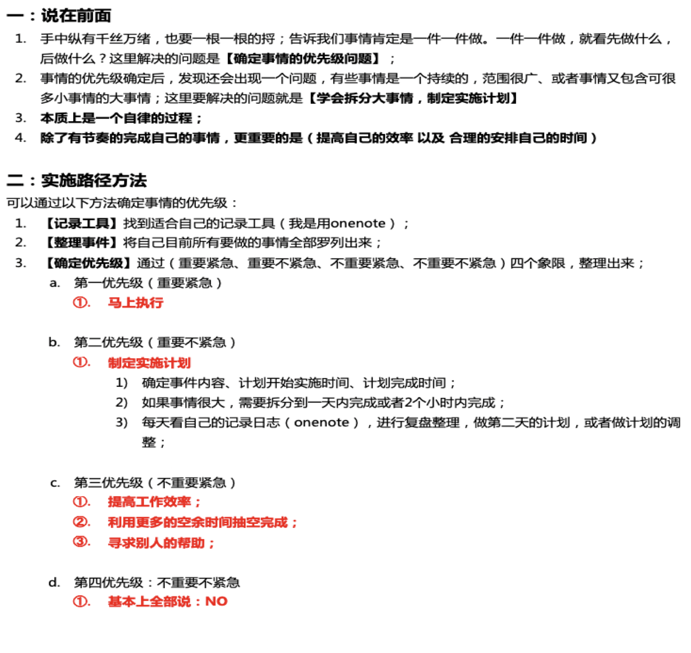

**遵循一个固定、程序化的流程，有规律地养成习惯**，实现自我提升。

## 每日必读

## 自律
离开学校，没有了课程表的安排，没有45分钟的约束。虽说上班也要遵守9点～6点，但是这中间每个小时做什么，没有了要求，只是安排了满满的工作，交给你，这个时间如何安排？ 6点之后的时间呢？又如何安排。

你可能会说，怎么不是过呢，做呗？ 

如果做的同时，可以做的更好，何乐而不为呢，学习安排自己合理的规则，还是有必要的。

<HideArticle/>
