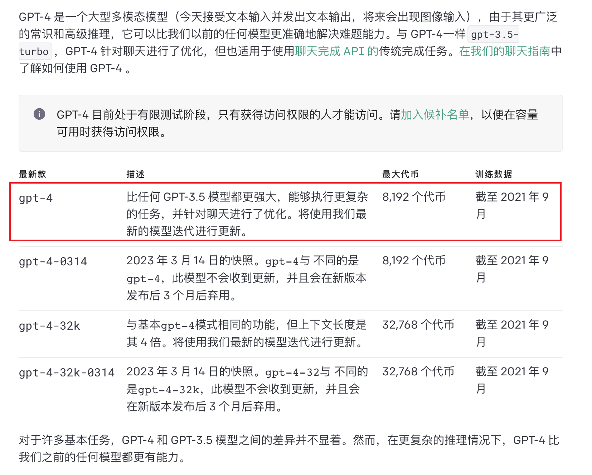

## 1. ChatGPT介绍

* ChatGPT 是⼀种基于深度学习的⾃然语⾔处理技术，它可以⽣成⾼质量的⾃然语⾔⽂本。该技术是由 OpenAI 团队开发，旨在使计算机能够像⼈类⼀样理解和产⽣⾃然语⾔。ChatGPT 使⽤了深度神经⽹络和⾃然语⾔处理技术，通过对⼤量语⾔数据的学习和建模，实现了⾃然语⾔⽣成和对话系统的⾃动化。
* ChatGPT 的核⼼是⼀个神经⽹络模型，该模型可以根据已有的语⾔数据集⾃动学习语⾔的规律和模式，并使⽤这些知识来⽣成新的⽂本。与传统的⾃然语⾔处理技术相⽐，ChatGPT 不需要⼿动编写规则或者特征⼯程，它可以⾃动从⼤规模的语⾔数据中学习到规律和模式，并将这些知识应⽤于⽣成新的⽂本。

* ChatGPT 在⾃然语⾔⽣成和对话系统领域有着⼴泛的应⽤，可以⽤于⽣成新闻报道、⼩说、诗歌、对话系统、客服机器⼈等。它可以⾃动为⽤户⽣成复杂的⾃然语⾔⽂本，从⽽⼤⼤提⾼了⾃然语⾔处理的效率和质量。

## 2. ChatGPT 的应⽤领域和前景ChatGPT 的应⽤领域和前景

* ChatGPT 的应⽤领域⾮常⼴泛，可以应⽤于⽂本⽣成、问答系统、机器翻译、对话系统、客服机器⼈等多种场景。
* 在⽂本⽣成⽅⾯，ChatGPT 可以⾃动为⽤户⽣成各种类型的⾃然语⾔⽂本，包括新闻报道、⼩说、诗歌、评论等。
* 在问答系统⽅⾯，ChatGPT 可以⾃动回答⽤户的问题，提供⾼质量的答案。在机器翻译⽅⾯，ChatGPT 可以将⼀种语⾔翻译成另⼀种语⾔，并保持语⾔的流畅和⾃然。在对话系统和客服机器⼈⽅⾯，ChatGPT 可以与⽤户进⾏⾃然、流畅的对话，提供⾼效、个性化的服务。

* ChatGPT 的出现为⾃然语⾔处理技术的发展带来了新的机遇和挑战。
* ChatGPT 可以帮助⼈们更加⾼效、⾃然地与计算机交互，实现更加智能、便捷的⼈机交互体验。同时，ChatGPT 的出现也提出了许多新的问题和挑战，⽐如如何保障语⾔的安全和隐私、如何避免⽂本⽣成的失控等。这些问题需要我们不断地思考和探索，才能实现⾃然语⾔处理技术的可持续发展。

## 3. ChatGPT 的历史和发展

ChatGPT是基于OpenAI的GPT-3模型而构建的，它是OpenAI对于以语言为中心的任务开发的一种交互式应用。以下是ChatGPT的历史和发展概述：

1. GPT-1：OpenAI的第一个"生成式预训练模型"（Generative Pre-trained Transformer，GPT）是GPT-1，于2018年发布。它使用了Transformer架构，并通过在大量文本数据上进行无监督的预训练来学习语言模型。

2. GPT-2：GPT-2在2019年发布，它在GPT-1的基础上进行了改进，引入了更大的模型规模和更多的参数。GPT-2在文本生成任务上展现出了惊人的能力，但由于其潜在的滥用风险，OpenAI最初选择限制了其访问。

3. GPT-3：GPT-3于2020年发布，是OpenAI迄今为止规模最大的模型。它包含了1750亿个参数，并在广泛的语言任务上表现出色。GPT-3的训练采用了与GPT-2类似的无监督预训练方法，然后可以通过微调来适应特定的任务。

4. ChatGPT：基于GPT-3模型，OpenAI开发了ChatGPT，旨在支持对话式交互。ChatGPT可以接收用户的输入并生成相关的回复。OpenAI通过不断改进和优化，提高了ChatGPT的可用性、响应性和对话质量，并在不断的迭代中逐步提供给用户。
5. 2023 年 3 月 14 日，微软 OpenAI 正式推出了它的最新GPT作品  ChatGPT 4 ，其具备接收图像输入的能力。与其前身  ChatGPT 3 和  ChatGPT-3.5  ChatGPT 3 和  ChatGPT-3.5  ChatGPT 4 为不再仅仅支持文本输入查询，他扩展了图片对话方式。仅供付费用户使用。

OpenAI持续改进和发展其语言模型，包括改进模型的质量、安全性和可控性。他们通过收集用户的反馈和经验教训，以及利用自然语言处理和机器学习的最新研究成果，不断改进模型的性能和功能。

## 4.目前常用的chatgpt3.5 和chatgpt4
* gpt3.5 是一组在 GPT-3 上改进的模型，可以理解并生成自然语言或代码;

* gpt 4 一组在 GPT-3.5 上改进的模型，可以理解并生成自然语言或代码

### gpt3.5 包含的模型:

### gpt4 包含的模型:

### 目前大家经常使用的模型就是：
* gpt-3.5-turbo
* gpt-4

### gpt-3.5 和 gpt 4 区别是什么呢？

1. 模型输入
    * GPT 4 现在可以识别图片了,即可以接受图像和文本作为输入，并输出文本；而GPT3.5只能接受文本作为输入，并输出文本。这使得GPT4可以处理更复杂且具有视觉信息的任务，如图像描述、图像问答、图像到文本等。
2. 返回值更长
    * GPT 4,最长可返回（MAX TOKEN） 8,192 tokens；
    * GPT3.5 最长可返回（MAX TOKEN）4,096 tokens
    * 意味着 GPT 4 可以在更长的对话中保持其准确性。
3. GPT-4有更长的记忆力
    * GPT-3.5 和 ChatGPT 的限制是大约 8,000 个单词，或大约四到五页的书。
    * GPT-4 的最大输入量大约 64,000 个单词或 50 页的文字，足以写成一出完整的戏剧或短篇小说，这就允许用户使用长格式内容创建、扩展对话以及文档搜索和分析等用例。
4. 最最重要的是：
    * 在官网使用 GPT-3.5 是完全免费的；
    * GPT-4 需要付费才可以使用。