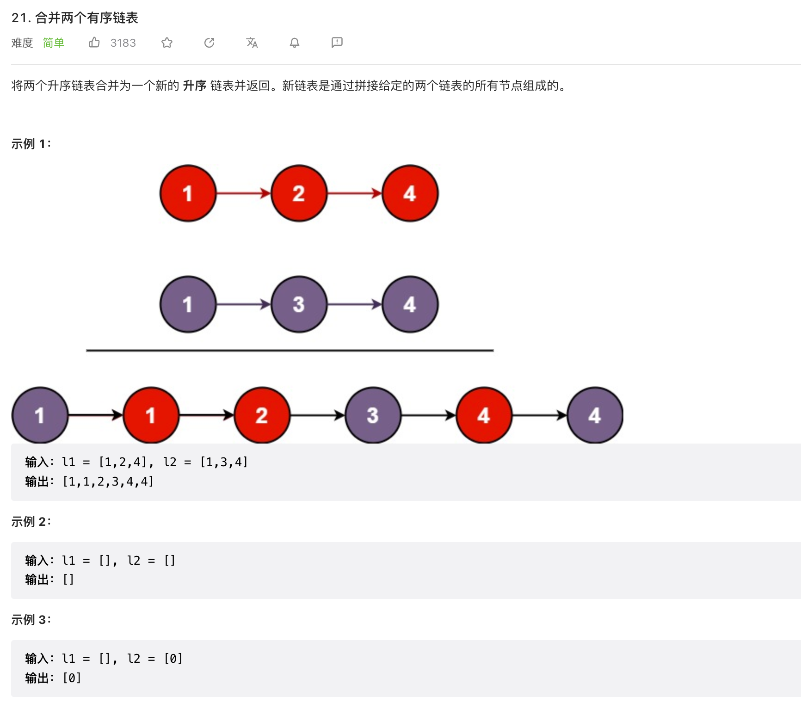

## 七道题:
1. 合并两个有序链表
2. 链表的分解
3. 合并 k 个有序链表
4. 寻找单链表的倒数第 k 个节点
5. 寻找单链表的中点
6. 判断单链表是否包含环并找出环起点
7. 判断两个单链表是否相交并找出交点

### 合并两个有序链表

[力扣](https://leetcode.cn/problems/merge-two-sorted-lists/)

::: tabs

@tab:active java

<!-- tab 1 内容 -->
/**
 * Definition for singly-linked list.
 * public class ListNode {
 *     int val;
 *     ListNode next;
 *     ListNode() {}
 *     ListNode(int val) { this.val = val; }
 *     ListNode(int val, ListNode next) { this.val = val; this.next = next; }
 * }
 */
class Solution {
    public ListNode mergeTwoLists(ListNode list1, ListNode list2) {
         ListNode p1 = list1,p2 = list2;
         ListNode m = new ListNode(-1);
         ListNode d = m;
         while(p1 != null && p2 != null){
             if(p1.val > p2.val){
                 d.next = new ListNode(p2.val);
                   p2 = p2.next;
             }else{
                 d.next= new ListNode(p1.val);
                 p1 = p1.next;
             }
              d = d.next;
         }
         if(p1 == null && p2 != null){
             d.next = p2;
         }
         if(p1 != null && p2 == null){
             d.next = p1;
         }
         return m.next;
    }
}

@tab python

<!-- tab 2 内容 -->

@tab go

<!-- tab 3 将会被默认激活 -->

<!-- tab 3 内容 -->
@tab node

@tab js

:::

