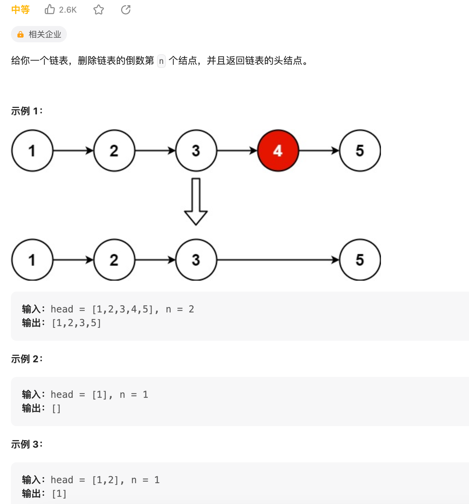
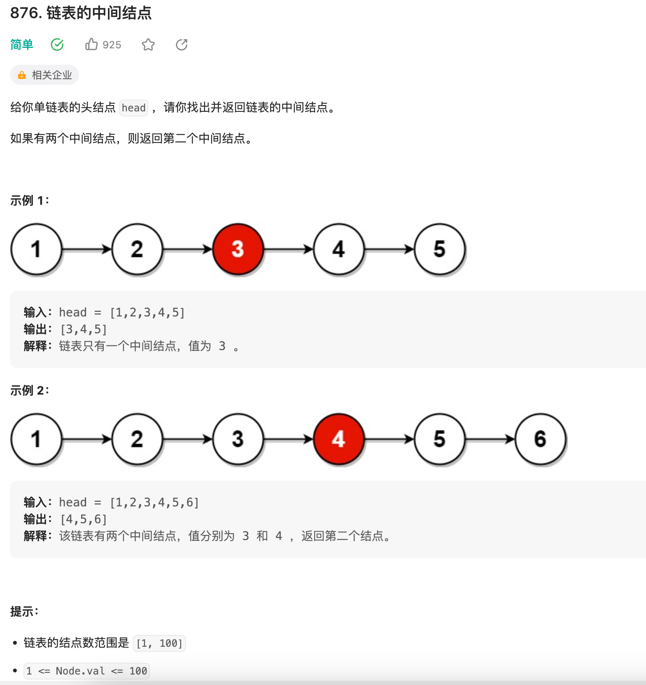
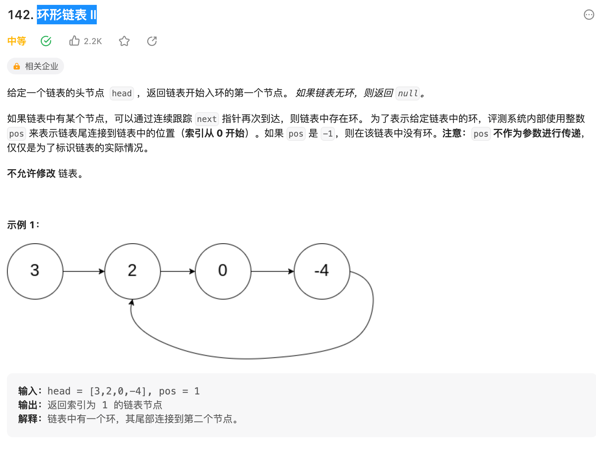
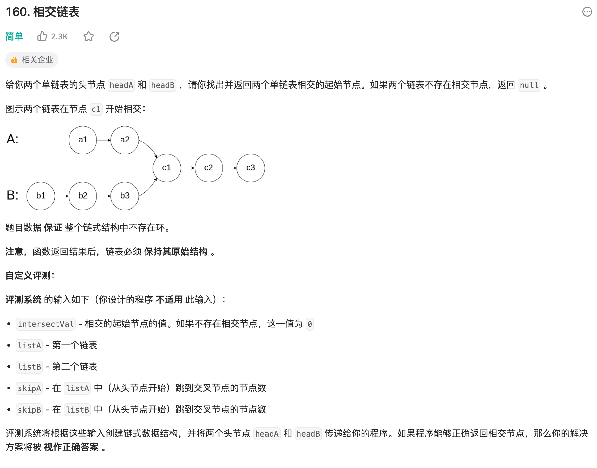
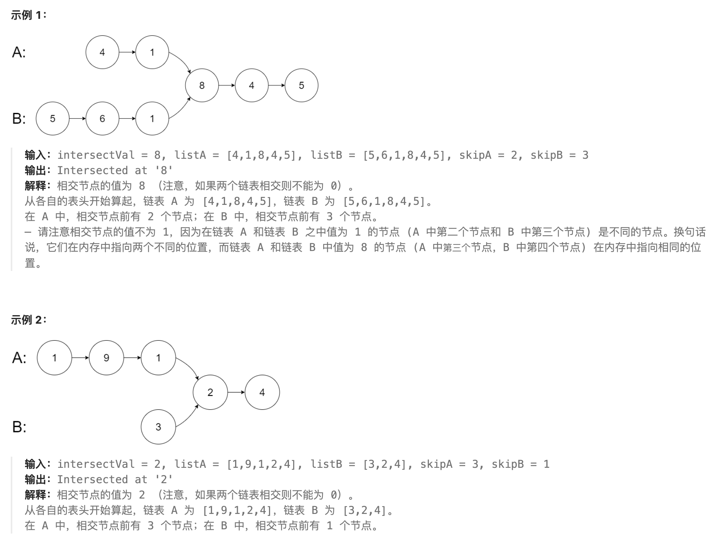

## 七道题:
1. 合并两个有序链表
2. 链表的分解
3. 合并 k 个有序链表
4. 寻找单链表的倒数第 k 个节点
5. 寻找单链表的中点
6. 判断单链表是否包含环并找出环起点
7. 判断两个单链表是否相交并找出交点


### 合并两个有序链表

[力扣](https://leetcode.cn/problems/merge-two-sorted-lists/)


::: tabs

@tab:active java

<!-- tab 1 内容 -->
- 非递归
``` java
/**
 * Definition for singly-linked list.
 * public class ListNode {
 *     int val;
 *     ListNode next;
 *     ListNode() {}
 *     ListNode(int val) { this.val = val; }
 *     ListNode(int val, ListNode next) { this.val = val; this.next = next; }
 * }
 */
class Solution {
    public ListNode mergeTwoLists(ListNode list1, ListNode list2) {
         ListNode p1 = list1,p2 = list2;
         ListNode m = new ListNode(-1);
         ListNode d = m;
         while(p1 != null && p2 != null){
             if(p1.val > p2.val){
                 d.next = new ListNode(p2.val);
                   p2 = p2.next;
             }else{
                 d.next= new ListNode(p1.val);
                 p1 = p1.next;
             }
              d = d.next;
         }
         if(p1 == null && p2 != null){
             d.next = p2;
         }
         if(p1 != null && p2 == null){
             d.next = p1;
         }
         return m.next;
    }
}
```
- 递归
``` java
class Solution {
    public ListNode mergeTwoLists(ListNode l1, ListNode l2) {
        if(l1 == null) {
            return l2;
        }
        if(l2 == null) {
            return l1;
        }

        if(l1.val < l2.val) {
            l1.next = mergeTwoLists(l1.next, l2);
            return l1;
        } else {
            l2.next = mergeTwoLists(l1, l2.next);
            return l2;
        }
    }
}
```
@tab python
```python
class Solution:
    def mergeTwoLists(self,l1 : ListNode,l2 : ListNode) -> ListNode{
        if l1 is None: return l2
        elif l2 is None: return l1
        elif l1.val < l2.val 
    }
```
<!-- tab 2 内容 -->

@tab go

<!-- tab 3 将会被默认激活 -->

<!-- tab 3 内容 -->
@tab node

@tab js

:::

### 单链表的分解


[力扣链接](https://leetcode.cn/problems/partition-list/)

::: tabs

@tab:active java

<!-- tab 1 内容 -->
- 非递归
``` java
/**
 * Definition for singly-linked list.
 * public class ListNode {
 *     int val;
 *     ListNode next;
 *     ListNode() {}
 *     ListNode(int val) { this.val = val; }
 *     ListNode(int val, ListNode next) { this.val = val; this.next = next; }
 * }
 */
class Solution {
    public ListNode partition(ListNode head, int x) {
        ListNode node = new ListNode(-1);
        ListNode node1 = new ListNode(-1);
        ListNode p1 = node;
        ListNode p2 = node1;
        while(head != null) {
             if(head.val < x){
                 p1.next = new ListNode(head.val);
                 p1 = p1.next;
             }else{
                 p2.next = new ListNode(head.val);
                 p2 = p2.next;
             }
             head = head.next;
        }
        p1.next = node1.next;
        return node.next;
    }
}
```
- 递归  
有解吗？
``` 
```
@tab python

<!-- tab 2 内容 -->

@tab go

<!-- tab 3 将会被默认激活 -->

<!-- tab 3 内容 -->
@tab node

@tab js

:::

### 合并 k 个有序链表


::: tabs

@tab:active java

<!-- tab 1 内容 -->
- 非递归: 优先队列
``` java
/**
 * Definition for singly-linked list.
 * public class ListNode {
 *     int val;
 *     ListNode next;
 *     ListNode() {}
 *     ListNode(int val) { this.val = val; }
 *     ListNode(int val, ListNode next) { this.val = val; this.next = next; }
 * }
 */
class Solution {
    public ListNode mergeKLists(ListNode[] lists) {
        if (lists.length == 0) return null;
            // 虚拟头结点
            ListNode dummy = new ListNode(-1);
            ListNode p = dummy;
            // 优先级队列，最小堆
            PriorityQueue<ListNode> pq = new PriorityQueue<>(
                lists.length, (a, b)->(a.val - b.val));
            // 将 k 个链表的头结点加入最小堆
            for (ListNode head : lists) {
                if (head != null)
                    pq.add(head);
            }

            while (!pq.isEmpty()) {
                // 获取最小节点，接到结果链表中
                ListNode node = pq.poll();
                p.next = node;
                if (node.next != null) {
                    pq.add(node.next);
                }
                // p 指针不断前进
                p = p.next;
            }
            return dummy.next;
    }
}
```
- 递归: 分治合并

``` java
/**
 * Definition for singly-linked list.
 * public class ListNode {
 *     int val;
 *     ListNode next;
 *     ListNode() {}
 *     ListNode(int val) { this.val = val; }
 *     ListNode(int val, ListNode next) { this.val = val; this.next = next; }
 * }
 */
class Solution {
     public ListNode mergeKLists(ListNode[] lists) {
         return merge(lists,0,lists.length -1);
    }

    public ListNode merge(ListNode [] lists,int l ,int r){
        if(l ==r) return lists[l];
        if(l > r) return null;
        int mid =(l+r) >>1;
        return mergeTwoLists(merge(lists,l,mid),merge(lists,mid+1,r));
    }
    public ListNode mergeTwoLists(ListNode a, ListNode b) {
        if (a == null || b == null) {
            return a != null ? a : b;
        }
        ListNode head = new ListNode(0);
        ListNode tail = head, aPtr = a, bPtr = b;
        while (aPtr != null && bPtr != null) {
            if (aPtr.val < bPtr.val) {
                tail.next = aPtr;
                aPtr = aPtr.next;
            } else {
                tail.next = bPtr;
                bPtr = bPtr.next;
            }
            tail = tail.next;
        }
        tail.next = (aPtr != null ? aPtr : bPtr);
        return head.next;
    }
}
```
@tab python

<!-- tab 2 内容 -->

@tab go

<!-- tab 3 将会被默认激活 -->

<!-- tab 3 内容 -->
@tab node

@tab js

:::
**复杂度分析**:
- 非递归: 优先队列
    - 时间复杂度: 考虑优先队列中的元素不超过 k 个，那么插入和删除的时间代价为 O(log⁡k)，这里最多有 kn个点，对于每个点都被插入删除各一次，故总的时间代价即渐进时间复杂度为 O(kn×log⁡k)。
    - 空间复杂度: 优先队列中的元素不超过 k 个，故渐进空间复杂度为 O(k)
- 递归： 分支合并
    - 时间复杂度：向上递归，第一个轮合并 k/2组链表，时间代价为o(2n)；第二组为k/4组链表，时间代价为o(4n)。。故渐进时间复杂度为 O(kn×log⁡k)。
    - 空间复杂度：递归使用O(log⁡k) 的栈空间

### 单链表的倒数第 k 个节点


::: tabs

@tab:active java

<!-- tab 1 内容 -->
- 非递归
``` java
/**
 * Definition for singly-linked list.
 * public class ListNode {
 *     int val;
 *     ListNode next;
 *     ListNode() {}
 *     ListNode(int val) { this.val = val; }
 *     ListNode(int val, ListNode next) { this.val = val; this.next = next; }
 * }
 */
class Solution {
    ListNode findFromEnd(ListNode head, int k) {
          ListNode p1 = head;
        // p1 先走 k 步
        for (int i = 0; i < k; i++) {
            p1 = p1.next;
        }
        ListNode p2 = head;
        // p1 和 p2 同时走 n - k 步
        while (p1 != null) {
            p2 = p2.next;
            p1 = p1.next;
        }
        // p2 现在指向第 n - k + 1 个节点，即倒数第 k 个节点
        return p2;
    }
}

```
@tab python
```python
class Solution:
    def removeNthFromEnd(self,head: ListNode,n:int) ->ListNode:
        dumy = ListNode(0,head)
        first = head
        second = dumy
        for i in range(n):
            first = first.next;
        while first:
            first= first.next;
            second = second.next;
        return dumy.next;
```
<!-- tab 2 内容 -->

@tab go
```go
func removeNthFormEnd(head *ListNode,n int) *ListNode{
    dumy := &ListNode{0,head}
    first,second := head,dumy
    for i := 0; i <n ;i++{
        first = first.Next
    }
    for ; first != nil ; first = first.Next {
        second = second.Next
    }
    return dumy.Next
}
```
<!-- tab 3 将会被默认激活 -->

<!-- tab 3 内容 -->
@tab node

@tab js

:::

**复杂度分析**:
- 时间复杂度: O(N),其中N 是链表的长度
- 空间复杂度: O(1)


### 删除链表的倒数第 N 个结点



::: tabs

@tab:active java

<!-- tab 1 内容 -->
- 非递归
``` java
/**
 * Definition for singly-linked list.
 * public class ListNode {
 *     int val;
 *     ListNode next;
 *     ListNode() {}
 *     ListNode(int val) { this.val = val; }
 *     ListNode(int val, ListNode next) { this.val = val; this.next = next; }
 * }
 */
class Solution {
    public ListNode removeNthFromEnd(ListNode head, int n) {
        ListNode dy = new ListNode(-1);
        dy.next = head;

        ListNode x = findFromEnd(dy,n+1);
         x.next = x.next.next;
         return dy.next;
    }
    ListNode findFromEnd(ListNode head, int k) {
          ListNode p1 = head;
        // p1 先走 k 步
        for (int i = 0; i < k; i++) {
            p1 = p1.next;
        }
        ListNode p2 = head;
        // p1 和 p2 同时走 n - k 步
        while (p1 != null) {
            p2 = p2.next;
            p1 = p1.next;
        }
        // p2 现在指向第 n - k + 1 个节点，即倒数第 k 个节点
        return p2;
    }
}
```
@tab python
```python
class Solution:
    def removeNthFromEnd(self,head: ListNode,n:int) ->ListNode:
        dumy = ListNode(0,head)
        first = head
        second = dumy
        for i in range(n):
            first = first.next;
        while first:
            first= first.next;
            second = second.next;
        second.next = second.next.next;
        return dumy.next;
```
<!-- tab 2 内容 -->

@tab go
```go
func removeNthFormEnd(head *ListNode,n int) *ListNode{
    dumy := &ListNode{0,head}
    first,second := head,dumy
    for i := 0; i <n ;i++{
        first = first.Next
    }
    for ; first != nil ; first = first.Next {
        second = second.Next
    }
    second.Next = second.Next.Next
    return dumy.Next
}
```

<!-- tab 3 将会被默认激活 -->

<!-- tab 3 内容 -->
@tab node

@tab js

:::

**复杂度分析**:
- 时间复杂度: O(N),其中N 是链表的长度
- 空间复杂度: O(1)

### 寻找单链表的中点


::: tabs

@tab:active java

<!-- tab 1 内容 -->
- 非递归
``` java
/**
 * Definition for singly-linked list.
 * public class ListNode {
 *     int val;
 *     ListNode next;
 *     ListNode() {}
 *     ListNode(int val) { this.val = val; }
 *     ListNode(int val, ListNode next) { this.val = val; this.next = next; }
 * }
 */
class Solution {
    public ListNode middleNode(ListNode head) {
        if(head == null) return null;
        ListNode fisrt = head, low = head;
        while(fisrt != null && fisrt.next != null){
            fisrt = fisrt.next.next;
            low = low.next;
        }
        return low;
    }
}
```
@tab python

```python
class Solution:
    def middleNode(self,head: ListNode) ->ListNode:
        slow = fast = head
        while fast and fast.next:
            slow = slow.next
            fast = fast.next.next
        return slow
```
<!-- tab 2 内容 -->

@tab go

<!-- tab 3 将会被默认激活 -->

<!-- tab 3 内容 -->
@tab node

@tab js
```js
var middleNode = function(head){
    slow = fast = head;
    while(fast && fast.next){
        slow = slow.next;
        fast = fast.next.next;
    }
    return slow;
}
```

:::

**复杂度分析**：
- 时间复杂度: O(N),其中N 是给定链表的结点数目。
- 空间复杂度: O(1),只需要常数空间存放 slow 和fast 两个指针。

### 判断链表是否包含环

::: tabs

@tab:active java

<!-- tab 1 内容 -->
- 非递归
``` java
/**
 * Definition for singly-linked list.
 * public class ListNode {
 *     int val;
 *     ListNode next;
 *     ListNode() {}
 *     ListNode(int val) { this.val = val; }
 *     ListNode(int val, ListNode next) { this.val = val; this.next = next; }
 * }
 */
class Solution {
    public boolean hasCycle(ListNode head) {
        if(head == null) return null;
        ListNode fisrt = head, low = head;
        while(fisrt != null && fisrt.next != null){
            fisrt = fisrt.next.next;
            low = low.next;
            // 等于，说明相遇了
            if(fisrt == low){
                return true;
            }
        }
        return false;
    }
}
```
@tab python

<!-- tab 2 内容 -->

@tab go

<!-- tab 3 将会被默认激活 -->

<!-- tab 3 内容 -->
@tab node

@tab js

:::

### 环形链表 II



::: tabs

@tab:active java

<!-- tab 1 内容 -->
- 非递归
``` java
/**
 * Definition for singly-linked list.
 * class ListNode {
 *     int val;
 *     ListNode next;
 *     ListNode(int x) {
 *         val = x;
 *         next = null;
 *     }
 * }
 */
public class Solution {
    public ListNode detectCycle(ListNode head) {
        if(head == null ) return null;
        ListNode fast = head,low = head;
        while(fast != null && fast.next != null) {
            fast = fast.next.next;
            low = low.next;
            if(fast == low) break;
        }
        if(fast == null || fast.next == null ) return null;
        low = head;
        while(fast != low){
            fast = fast.next;
            low = low.next;
        }
        return low;
    }
}
```
@tab python

<!-- tab 2 内容 -->
```python
class Solution(object):
    def detectCycle(self,head):
        fast,slow = head,head
        while True:
            if not (fast and fast.next) : return
            fast,slow = fast.next.next,slow.next
            if fast == slow: break
        if not fast || not fast.next: return None
        fast = head
        while fast != slow:
            fast,slow = fast.next,slow.next
        return fast
```

@tab go

```go
/**
 * Definition for singly-linked list.
 * type ListNode struct {
 *     Val int
 *     Next *ListNode
 * }
 */
func detectCycle(head *ListNode) *ListNode{
    slow,fast := head,head
    for fast != nil {
        slow = slow.Next
        if fast.Next == nil {
            return nil
        }
        fast = fast.Next.Next
        if fast == slow {
            p := head
            for p != slow {
                p = p.Next
                slow = slow.Next
            }
            return p
        }
    }
    return nil
}

```
<!-- tab 3 将会被默认激活 -->

<!-- tab 3 内容 -->
@tab node

@tab js

:::

**复杂度分析**：
- 时间复杂度O(N): 其中 NNN 为链表中节点的数目。在最初判断快慢指针是否相遇时，slow 指针走过的距离不会超过链表的总长度；随后寻找入环点时，走过的距离也不会超过链表的总长度。因此，总的执行时间为 O(N)+O(N)=O(N)。
- 空间复杂度O(1)： slow，fast 两个指针

### 两个链表是否相交



::: tabs

@tab:active java

<!-- tab 1 内容 -->
- 非递归
``` java
/**
 * Definition for singly-linked list.
 * class ListNode {
 *     int val;
 *     ListNode next;
 *     ListNode(int x) {
 *         val = x;
 *         next = null;
 *     }
 * }
 */
public class Solution {
    public ListNode getIntersectionNode(ListNode headA, ListNode headB) {
        // p1 指向 A 链表头结点，p2 指向 B 链表头结点
        ListNode p1 = headA, p2 = headB;
        while (p1 != p2) {
            // p1 走一步，如果走到 A 链表末尾，转到 B 链表
            if (p1 == null) p1 = headB;
            else  p1 = p1.next;
            // p2 走一步，如果走到 B 链表末尾，转到 A 链表
            if (p2 == null) p2 = headA;
            else  p2 = p2.next;
        }
        return p1;
    }

}
```
@tab python

<!-- tab 2 内容 -->

@tab go
```go
func getIntersectionNode(headA ,headB *ListNode) *ListNode{
    if(headA == nil || headB == nil) return nil;
    pa,pb := headA,headB
    for pa != pb{
        if pa == nil{
            pa = headB
        }else {
            pa = pa.Next
        }
        if pb==nil{
            pb =headA
        }else{
            pb =pb.next
        }
    }
    return pa 
}
```

<!-- tab 3 将会被默认激活 -->

<!-- tab 3 内容 -->
@tab node

@tab js
```js
var getIntersectionNode =function(headA,headB){
    if(headA == null || headB == null) return null;
    let paA = headA, paB = headB
    while(paA !== paB){
       paA = paA !== null ? paA.next : headB;
       paB = paB !== null ? paB.next : headA;
    }
    return paA;
}
```
:::

复杂度分析：
- 时间复杂度: O(m+n),其中m 和 n，分别是链表headA 和 headB 的长度。两个指针同时遍历两个链表，每个指针遍历两个链表各一次。
- 空间复杂度: O(1).

leetCode:
[相交链表](https://leetcode.cn/problems/intersection-of-two-linked-lists/description/)
[环形链表 II](https://leetcode.cn/problems/linked-list-cycle-ii/description/)


https://oapi.dingtalk.com/robot/send?access_token=59f5ec4605c57ffa571c2a38aa0776f3a11d7a6ef50aa200d10a714bf0411c96