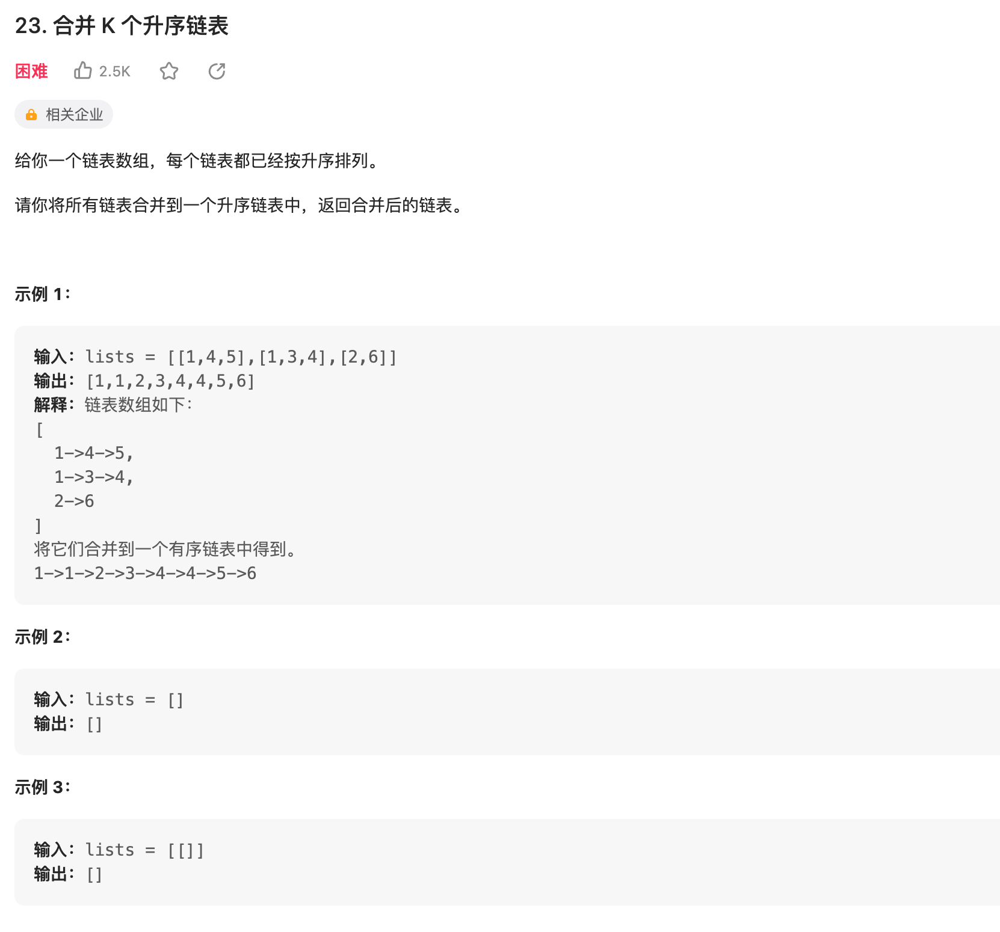

## 七道题:
1. 合并两个有序链表
2. 链表的分解
3. 合并 k 个有序链表
4. 寻找单链表的倒数第 k 个节点
5. 寻找单链表的中点
6. 判断单链表是否包含环并找出环起点
7. 判断两个单链表是否相交并找出交点


### 合并两个有序链表

[力扣](https://leetcode.cn/problems/merge-two-sorted-lists/)


::: tabs

@tab:active java

<!-- tab 1 内容 -->
- 非递归
``` java
/**
 * Definition for singly-linked list.
 * public class ListNode {
 *     int val;
 *     ListNode next;
 *     ListNode() {}
 *     ListNode(int val) { this.val = val; }
 *     ListNode(int val, ListNode next) { this.val = val; this.next = next; }
 * }
 */
class Solution {
    public ListNode mergeTwoLists(ListNode list1, ListNode list2) {
         ListNode p1 = list1,p2 = list2;
         ListNode m = new ListNode(-1);
         ListNode d = m;
         while(p1 != null && p2 != null){
             if(p1.val > p2.val){
                 d.next = new ListNode(p2.val);
                   p2 = p2.next;
             }else{
                 d.next= new ListNode(p1.val);
                 p1 = p1.next;
             }
              d = d.next;
         }
         if(p1 == null && p2 != null){
             d.next = p2;
         }
         if(p1 != null && p2 == null){
             d.next = p1;
         }
         return m.next;
    }
}
```
- 递归
``` java
class Solution {
    public ListNode mergeTwoLists(ListNode l1, ListNode l2) {
        if(l1 == null) {
            return l2;
        }
        if(l2 == null) {
            return l1;
        }

        if(l1.val < l2.val) {
            l1.next = mergeTwoLists(l1.next, l2);
            return l1;
        } else {
            l2.next = mergeTwoLists(l1, l2.next);
            return l2;
        }
    }
}
```
@tab python

<!-- tab 2 内容 -->

@tab go

<!-- tab 3 将会被默认激活 -->

<!-- tab 3 内容 -->
@tab node

@tab js

:::

### 单链表的分解


[力扣链接](https://leetcode.cn/problems/partition-list/)

::: tabs

@tab:active java

<!-- tab 1 内容 -->
- 非递归
``` java
/**
 * Definition for singly-linked list.
 * public class ListNode {
 *     int val;
 *     ListNode next;
 *     ListNode() {}
 *     ListNode(int val) { this.val = val; }
 *     ListNode(int val, ListNode next) { this.val = val; this.next = next; }
 * }
 */
class Solution {
    public ListNode partition(ListNode head, int x) {
        ListNode node = new ListNode(-1);
        ListNode node1 = new ListNode(-1);
        ListNode p1 = node;
        ListNode p2 = node1;
        while(head != null) {
             if(head.val < x){
                 p1.next = new ListNode(head.val);
                 p1 = p1.next;
             }else{
                 p2.next = new ListNode(head.val);
                 p2 = p2.next;
             }
             head = head.next;
        }
        p1.next = node1.next;
        return node.next;
    }
}
```
- 递归  
有解吗？
``` 
```
@tab python

<!-- tab 2 内容 -->

@tab go

<!-- tab 3 将会被默认激活 -->

<!-- tab 3 内容 -->
@tab node

@tab js

:::

### 合并 k 个有序链表



::: tabs

@tab:active java

<!-- tab 1 内容 -->
- 非递归
``` java
/**
 * Definition for singly-linked list.
 * public class ListNode {
 *     int val;
 *     ListNode next;
 *     ListNode() {}
 *     ListNode(int val) { this.val = val; }
 *     ListNode(int val, ListNode next) { this.val = val; this.next = next; }
 * }
 */
class Solution {
    public ListNode mergeKLists(ListNode[] lists) {
        if (lists.length == 0) return null;
            // 虚拟头结点
            ListNode dummy = new ListNode(-1);
            ListNode p = dummy;
            // 优先级队列，最小堆
            PriorityQueue<ListNode> pq = new PriorityQueue<>(
                lists.length, (a, b)->(a.val - b.val));
            // 将 k 个链表的头结点加入最小堆
            for (ListNode head : lists) {
                if (head != null)
                    pq.add(head);
            }

            while (!pq.isEmpty()) {
                // 获取最小节点，接到结果链表中
                ListNode node = pq.poll();
                p.next = node;
                if (node.next != null) {
                    pq.add(node.next);
                }
                // p 指针不断前进
                p = p.next;
            }
            return dummy.next;
    }
}
```
- 递归  
有解吗？
``` 
```
@tab python

<!-- tab 2 内容 -->

@tab go

<!-- tab 3 将会被默认激活 -->

<!-- tab 3 内容 -->
@tab node

@tab js

:::

### 单链表的倒数第 k 个节点


::: tabs

@tab:active java

<!-- tab 1 内容 -->
- 非递归
``` java
/**
 * Definition for singly-linked list.
 * public class ListNode {
 *     int val;
 *     ListNode next;
 *     ListNode() {}
 *     ListNode(int val) { this.val = val; }
 *     ListNode(int val, ListNode next) { this.val = val; this.next = next; }
 * }
 */
class Solution {
    ListNode findFromEnd(ListNode head, int k) {
          ListNode p1 = head;
        // p1 先走 k 步
        for (int i = 0; i < k; i++) {
            p1 = p1.next;
        }
        ListNode p2 = head;
        // p1 和 p2 同时走 n - k 步
        while (p1 != null) {
            p2 = p2.next;
            p1 = p1.next;
        }
        // p2 现在指向第 n - k + 1 个节点，即倒数第 k 个节点
        return p2;
    }
}

```
@tab python

<!-- tab 2 内容 -->

@tab go

<!-- tab 3 将会被默认激活 -->

<!-- tab 3 内容 -->
@tab node

@tab js

:::

### 删除链表的倒数第 N 个结点


::: tabs

@tab:active java

<!-- tab 1 内容 -->
- 非递归
``` java
/**
 * Definition for singly-linked list.
 * public class ListNode {
 *     int val;
 *     ListNode next;
 *     ListNode() {}
 *     ListNode(int val) { this.val = val; }
 *     ListNode(int val, ListNode next) { this.val = val; this.next = next; }
 * }
 */
class Solution {
    public ListNode removeNthFromEnd(ListNode head, int n) {
        ListNode dy = new ListNode(-1);
        dy.next = head;

         ListNode tmp = dy;
         for(int i=0;i< n+1 ; i ++){
             tmp = tmp.next;
         }
          ListNode p = dy;
         while(tmp != null){
             tmp = tmp.next;
             p = p.next;
         }
          
        //  p.next = p.next.next;
         return p;
    }
}
```
@tab python

<!-- tab 2 内容 -->

@tab go

<!-- tab 3 将会被默认激活 -->

<!-- tab 3 内容 -->
@tab node

@tab js

:::

### 寻找单链表的中点


::: tabs

@tab:active java

<!-- tab 1 内容 -->
- 非递归
``` java
/**
 * Definition for singly-linked list.
 * public class ListNode {
 *     int val;
 *     ListNode next;
 *     ListNode() {}
 *     ListNode(int val) { this.val = val; }
 *     ListNode(int val, ListNode next) { this.val = val; this.next = next; }
 * }
 */
class Solution {
    public ListNode middleNode(ListNode head) {
        if(head == null) return null;
        ListNode fisrt = head, low = head;
        while(fisrt != null && fisrt.next != null){
            fisrt = fisrt.next.next;
            low = low.next;
        }
        return low;
    }
}
```
@tab python

<!-- tab 2 内容 -->

@tab go

<!-- tab 3 将会被默认激活 -->

<!-- tab 3 内容 -->
@tab node

@tab js

:::

### 判断链表是否包含环

::: tabs

@tab:active java

<!-- tab 1 内容 -->
- 非递归
``` java
/**
 * Definition for singly-linked list.
 * public class ListNode {
 *     int val;
 *     ListNode next;
 *     ListNode() {}
 *     ListNode(int val) { this.val = val; }
 *     ListNode(int val, ListNode next) { this.val = val; this.next = next; }
 * }
 */
class Solution {
    public boolean hasCycle(ListNode head) {
        if(head == null) return null;
        ListNode fisrt = head, low = head;
        while(fisrt != null && fisrt.next != null){
            // 等于，说明相遇了
            if(fisrt == low){
                break;
            }
            fisrt = fisrt.next.next;
            low = low.next;
        }
        if(fisrt != null){
            return true;
        }
        return false;
    }
}
```
@tab python

<!-- tab 2 内容 -->

@tab go

<!-- tab 3 将会被默认激活 -->

<!-- tab 3 内容 -->
@tab node

@tab js

:::

### 环形链表 II


::: tabs

@tab:active java

<!-- tab 1 内容 -->
- 非递归
``` java
/**
 * Definition for singly-linked list.
 * class ListNode {
 *     int val;
 *     ListNode next;
 *     ListNode(int x) {
 *         val = x;
 *         next = null;
 *     }
 * }
 */
public class Solution {
    public ListNode detectCycle(ListNode head) {
        if(head == null ) return null;
        ListNode fast = head,low = head;
        while(fast != null && fast.next != null) {
            fast = fast.next.next;
            low = low.next;
            if(fast == low) break;
        }
        if(fast == null || fast.next == null ) return null;
        low = head;
        while(fast != low){
            fast = fast.next;
            low = low.next;
        }
        return low;
    }
}
```
@tab python

<!-- tab 2 内容 -->

@tab go

<!-- tab 3 将会被默认激活 -->

<!-- tab 3 内容 -->
@tab node

@tab js

:::
