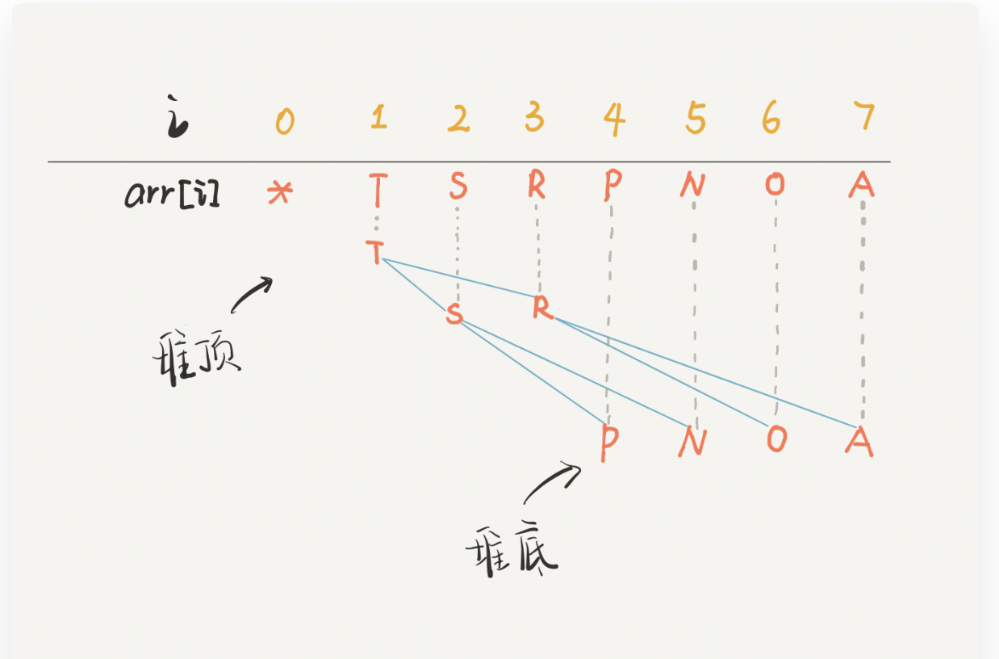

# 优先队列

## 实现核心： 二叉堆

### 定义：

二叉堆（Binary Heap）性质比二叉搜索树 BST 还简单。其主要操作就两个，`sin`（下沉）和 `swim`（上浮），用以维护二叉堆的性质。

二叉堆在逻辑上是一种特殊的二叉树（完全二叉树），只不过存储在数组里。

图示：

`arr`是一个字符数组，注意数组的第一个索引 0 空着不用。

把 `arr[1]`作为整棵树的根的话，每个节点的父节点和左右孩子的索引都可以通过简单的运算得到，这就是二叉堆设计的一个巧妙之处。



### 数组的方式，操作树的索引：

```java
// 父节点的索引
int parent(int root) {
    return root / 2;
}
// 左孩子的索引
int left(int root) {
    return root * 2;
}
// 右孩子的索引
int right(int root) {
    return root * 2 + 1;
}
```

### 最大堆和最小堆：

- 最大堆的性质是：每个节点都大于等于它的两个子节点;
- 最小堆的性质是：每个节点都小于等于它的子节点。

## **实现 swim 和 sink**

在插入元素和删除元素时，难免破坏堆的性质，这就需要通过这两个操作来恢复堆的性质了。

### 最大堆的实现：

对于最大堆，会破坏堆性质的有两种情况：

1、如果某个节点 A 比它的子节点（中的一个）小，那么 A 就不配做父节点，应该下去，下面那个更大的节点上来做父节点，这就是对 A 进行**下沉**。

2、如果某个节点 A 比它的父节点大，那么 A 不应该做子节点，应该把父节点换下来，自己去做父节点，这就是对 A 的**上浮**。

**上浮的代码实现：**

上浮某个节点 A，只需要 A 和其父节点比较大小即可。

```java
private void swim(int x) {
    // 如果浮到堆顶，就不能再上浮了
    while (x > 1 && less(parent(x), x)) {
        // 如果第 x 个元素比上层大
        // 将 x 换上去
        swap(parent(x), x);
        x = parent(x);
    }
}
```

**下沉的代码实现：**

下沉某个节点 A，需要 A 和其**两个子节点**比较大小，如果 A 不是最大的就需要调整位置，要把较大的那个子节点和 A 交换。

```java
private void sink(int x) {
    // 如果沉到堆底，就沉不下去了
    while (left(x) <= size) {
        // 先假设左边节点较大
        int max = left(x);
        // 如果右边节点存在，比一下大小
        if (right(x) <= size && less(max, right(x)))
            max = right(x);
        // 结点 x 比俩孩子都大，就不必下沉了
        if (less(max, x)) break;
        // 否则，不符合最大堆的结构，下沉 x 结点
        swap(x, max);
        x = max;
    }
}
```

### 最小堆的实现：

对于最小堆，会破坏堆性质的有两种情况：

1、如果某个节点 A 比它的子节点（中的一个）大，那么 A 就不配做父节点，应该下去，下面那个更小的节点上来做父节点，这就是对 A 进行**下沉**。

2、如果某个节点 A 比它的父节点小，那么 A 不应该做子节点，应该把父节点换下来，自己去做父节点，这就是对 A 的**上浮**。

**上浮的代码实现：**

```java
private void swim(int x) {
    // 如果浮到堆顶，就不能再上浮了
    while (x > 1 && less(x,parent(x))) {
        // 如果第 x 个元素比上层小
        // 将 x 换上去
        swap(parent(x), x);
        x = parent(x);
    }
}
```

**下沉的代码实现：**

```java
/**
   * 下沉
 */
private int sink(int x) {
    while(left(x) < size) { //至少存在左子节点
        // 先假设左边节点较小
        int min = left(x);
        if(right(x) <= size && less(right(x),min)) min = right(x);
        if(less(x,min)) break;
        swap(x,min);
        x = min;
    }
}
```

## 插入和删除操作：

插入：

**先把要插入的元素添加到堆底的最后，然后让其上浮到正确位置。**

```java
public void insert(Key e) {
    size++;
    // 先把新元素加到最后
    pq[size] = e;
    // 然后让它上浮到正确的位置
    swim(size);
}
```

删除：

**先把堆顶元素 `A` 和堆底最后的元素 `B` 对调，然后删除 `A`，最后让 `B` 下沉到正确位置**。

如果是最大堆，删除并返回的就是最大元素；如果是最小堆，删除并返回的就是最小元素。

```java
public Key del() {
 
    Key top = pq[1];
    // 把这个最大元素换到最后，删除之
    swap(1, size);
    pq[size] = null;
    size--;
    // 让 pq[1] 下沉到正确位置
    sink(1);
    return top;
}
```

## 最大堆的完整实现：

```java
public class MaxHeap<Key extends Comparable<Key>> {
    // 存储元素的数组
    private Key[] pq;
    // 当前 Priority Queue 中的元素个数
    private int size = 0;

    public MaxHeap(int cap) {
        // 索引 0 不用，所以多分配一个空间
        pq = (Key[]) new Comparable[cap + 1];
    }

    /* 返回当前队列中最大元素 */
    public Key max() {
        return pq[1];
    }

    /* 插入元素 e */
		 public void insert(Key e) {
		    size++;
		    // 先把新元素加到最后
		    pq[size] = e;
		    // 然后让它上浮到正确的位置
		    swim(size);
		}

    /* 删除并返回当前队列中最大元素 */
    public Key delMax() {
 
	    Key top = pq[1];
	    // 把这个最大元素换到最后，删除之
	    swap(1, size);
	    pq[size] = null;
	    size--;
	    // 让 pq[1] 下沉到正确位置
	    sink(1);
	    return top;
   }

    /* 上浮第 x 个元素，以维护最大堆性质 */
		private void swim(int x) {
		    // 如果浮到堆顶，就不能再上浮了
		    while (x > 1 && less(parent(x), x)) {
		        // 如果第 x 个元素比上层大
		        // 将 x 换上去
		        swap(parent(x), x);
		        x = parent(x);
		    }
		}

    /* 下沉第 x 个元素，以维护最大堆性质 */
	 private void sink(int x) {
	    // 如果沉到堆底，就沉不下去了
	    while (left(x) <= size) {
	        // 先假设左边节点较大
	        int max = left(x);
	        // 如果右边节点存在，比一下大小
	        if (right(x) <= size && less(max, right(x)))
	            max = right(x);
	        // 结点 x 比俩孩子都大，就不必下沉了
	        if (less(max, x)) break;
	        // 否则，不符合最大堆的结构，下沉 x 结点
	        swap(x, max);
	        x = max;
	    }
	}

    /* 交换数组的两个元素 */
    private void swap(int i, int j) {
        Key temp = pq[i];
        pq[i] = pq[j];
        pq[j] = temp;
    }

    /* pq[i] 是否比 pq[j] 小？ */
    private boolean less(int i, int j) {
        return pq[i].compareTo(pq[j]) < 0;
    }

    // 父节点的索引
		int parent(int root) {
		    return root / 2;
		}
		// 左孩子的索引
		int left(int root) {
		    return root * 2;
		}
		// 右孩子的索引
		int right(int root) {
		    return root * 2 + 1;
		}
}
```

## 最小堆的完整实现：

```java
public class MinHeap<Key extends Comparable<Key>> {
    // 存储元素的数组
    private Key[] pq;
    // 当前 Priority Queue 中的元素个数
    private int size = 0;

    public MinHeap(int cap) {
        // 索引 0 不用，所以多分配一个空间
        pq = (Key[]) new Comparable[cap + 1];
    }

    /* 返回当前队列中最小元素 */
    public Key min() {
        return pq[1];
    }

    /* 插入元素 e */
		 public void insert(Key e) {
		    size++;
		    // 先把新元素加到最后
		    pq[size] = e;
		    // 然后让它上浮到正确的位置
		    swim(size);
		}

    /* 删除并返回当前队列中最小元素 */
    public Key delMin() {
 
	    Key top = pq[1];
	    // 把这个最小元素换到最后，删除之
	    swap(1, size);
	    pq[size] = null;
	    size--;
	    // 让 pq[1] 下沉到正确位置
	    sink(1);
	    return top;
   }

    /* 上浮第 x 个元素，以维护最小堆性质 */
private void swim(int x) {
    // 如果浮到堆顶，就不能再上浮了
    while (x > 1 && less(x,parent(x))) {
        // 如果第 x 个元素比上层小
        // 将 x 换上去
        swap(parent(x), x);
        x = parent(x);
    }
}

	/**
	   * 下沉
	 */
	private int sink(int x) {
	    while(left(x) < size) { //至少存在左子节点
	        // 先假设左边节点较小
	        int min = left(x);
	        if(right(x) <= size && less(right(x),min)) min = right(x);
	        if(less(x,min)) break;
	        swap(x,min);
	        x = min;
	    }
	}

    /* 交换数组的两个元素 */
    private void swap(int i, int j) {
        Key temp = pq[i];
        pq[i] = pq[j];
        pq[j] = temp;
    }

    /* pq[i] 是否比 pq[j] 小？ */
    private boolean less(int i, int j) {
        return pq[i].compareTo(pq[j]) < 0;
    }

    // 父节点的索引
		int parent(int root) {
		    return root / 2;
		}
		// 左孩子的索引
		int left(int root) {
		    return root * 2;
		}
		// 右孩子的索引
		int right(int root) {
		    return root * 2 + 1;
		}
}
```

# 优先队列：