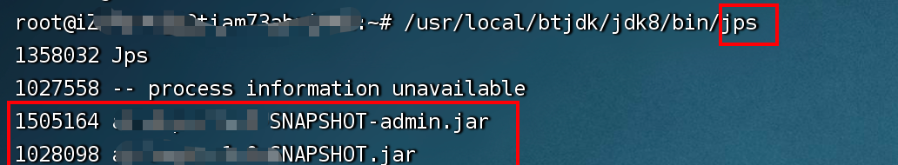
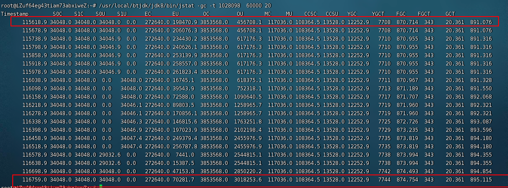

# 1. 获取java 进程的pid
1. ps -ef | grep java

2. jps

# 2. 使用jmap
##  jmap -heap pid   
   获取整个堆空间的详细信息。包括GC的使用、堆的配置信息，以及内存的使用信息等。   

   ```
   root@iZuf64eg43tiam73abxiweZ:~# /usr/local/btjdk/jdk8/bin/jmap -heap 1028098
    Attaching to process ID 1028098, please wait...
    Debugger attached successfully.
    Server compiler detected.
    JVM version is 25.71-b00
    #1.
    using parallel threads in the new generation.
    using thread-local object allocation.
    Concurrent Mark-Sweep GC
    # 2. 
    Heap Configuration:
      MinHeapFreeRatio         = 40
      MaxHeapFreeRatio         = 70
      MaxHeapSize              = 4294967296 (4096.0MB)
      NewSize                  = 348913664 (332.75MB)
      MaxNewSize               = 348913664 (332.75MB)
      OldSize                  = 3946053632 (3763.25MB)
      NewRatio                 = 2
      SurvivorRatio            = 8
      MetaspaceSize            = 21807104 (20.796875MB)
      CompressedClassSpaceSize = 1073741824 (1024.0MB)
      MaxMetaspaceSize         = 17592186044415 MB
      G1HeapRegionSize         = 0 (0.0MB)
    #3. 
    Heap Usage:
    New Generation (Eden + 1 Survivor Space):
      capacity = 314048512 (299.5MB)
      used     = 166875944 (159.14530181884766MB)
      free     = 147172568 (140.35469818115234MB)
      53.136995598947465% used
    Eden Space:
      capacity = 279183360 (266.25MB)
      used     = 132010792 (125.89530181884766MB)
      free     = 147172568 (140.35469818115234MB)
      47.28462040144513% used
    From Space:
      capacity = 34865152 (33.25MB)
      used     = 34865152 (33.25MB)
      free     = 0 (0.0MB)
      100.0% used
    To Space:
      capacity = 34865152 (33.25MB)
      used     = 0 (0.0MB)
      free     = 34865152 (33.25MB)
      0.0% used
    concurrent mark-sweep generation:
      capacity = 3946053632 (3763.25MB)
      used     = 1832479232 (1747.58837890625MB)
      free     = 2113574400 (2015.66162109375MB)
      46.43827486630572% used

    38355 interned Strings occupying 4029456 bytes.

   ```
   1. 第一部分：
   ```
    using parallel threads in the new generation.
    using thread-local object allocation.
    Concurrent Mark-Sweep GC
   ```
   - 使用的是serial收集器（也叫串行收集器）即 Mark Sweep Compact GC。   
   2. 第二部分：
   ```
    Heap Configuration:
      MinHeapFreeRatio         = 40
      MaxHeapFreeRatio         = 70
      MaxHeapSize              = 4294967296 (4096.0MB)
      NewSize                  = 348913664 (332.75MB)
      MaxNewSize               = 348913664 (332.75MB)
      OldSize                  = 3946053632 (3763.25MB)
      NewRatio                 = 2
      SurvivorRatio            = 8
      MetaspaceSize            = 21807104 (20.796875MB)
      CompressedClassSpaceSize = 1073741824 (1024.0MB)
      MaxMetaspaceSize         = 17592186044415 MB
      G1HeapRegionSize         = 0 (0.0MB)
   ```
   - MinHeapFreeRatio和MaxHeapFreeRatio: 设置堆的最小最大空闲比例。
   - MaxHeapSize: 堆的最大大小。
   - NewSize: 新生代的默认值。
   - MaxNewSize: 新生代的最大值
   - OldSize: 老年代的默认值。
   - NewRatio: 新生代和老年代的大小比例，即老年代:新生代=2:1,默认为2.
   - SurvivorRatio: 新生代中的eden区与survivor的比例=8:1.
   - MetaspaceSize: 1.8 开始叫元空间大小,使用本地内存的
   - CompressedClassSpaceSize: 类指针压缩空间大小, 默认为1G
   - MaxMetaspaceSize: 元空间的最大值。一般设置和MetaspaceSize一样大小。
   - G1HeapRegionSize: G1区块的大小, 取值为1M至32M. 其取值是要根据最小Heap大小划分出2048个区块
   3. 第三部分:
   ```
    New Generation (Eden + 1 Survivor Space):
      capacity = 314048512 (299.5MB)
      used     = 166875944 (159.14530181884766MB)
      free     = 147172568 (140.35469818115234MB)
      53.136995598947465% used
   ```
   - 新生代: 指eden加上一个survivor空间。容量有300M这样，使用了159M，还有140M空闲. 接近53%的使用率。（根据分代的思想，新生代都是一个eden 加上2个survivor）   
   ```
    Eden Space:
      capacity = 279183360 (266.25MB)
      used     = 132010792 (125.89530181884766MB)
      free     = 147172568 (140.35469818115234MB)
      47.28462040144513% used
   ```
   - 单独的eden区: 大小为266M,使用125M,空闲140, 使用率47%
   ```
    From Space:
      capacity = 34865152 (33.25MB)
      used     = 34865152 (33.25MB)
      free     = 0 (0.0MB)
      100.0% used
   ```
   - 一个surivor区，是在使用着的
   ```    
   To Space:
      capacity = 34865152 (33.25MB)
      used     = 0 (0.0MB)
      free     = 34865152 (33.25MB)
      0.0% used
   ```
   - 另一个survivor的使用情况。此时没有被使用。和From Space 大小一致；
   ```
    concurrent mark-sweep generation:
      capacity = 3946053632 (3763.25MB)
      used     = 1832479232 (1747.58837890625MB)
      free     = 2113574400 (2015.66162109375MB)
      46.43827486630572% used
   ```
  - 老年代： 总的大小是3763M，使用1747M,空闲2015M,使用率是46%。
  4. 总结：
     为java 进程分配了 4096M 的内存；
     Eden Space + From Space + To Space + concurrent mark-sweep generation = 4096


# 3. 使用jstat
jstat -gc -t 1028098  60000 20


从图中红框标记的的两条数据分析：
- 一分钟采集1次gc 的数据，第一条和最后一条就是 19分钟。
1. GCT 总的gc 时间是 891.076秒
2. GCT 总的gc 时间是  895.115 秒
系统的吞吐量 = 1- （895.115-891.076）/ 19 *60   = 1- 0.0035  = 0.9965 = 99.65%
