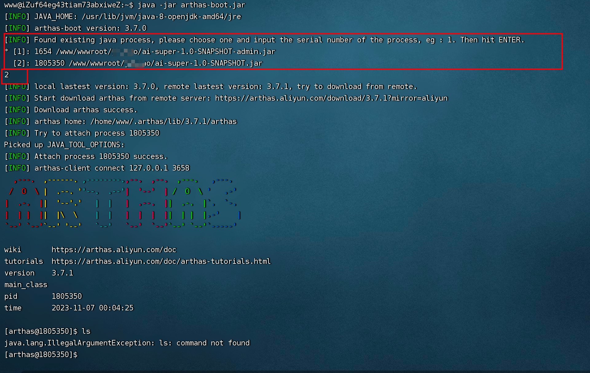
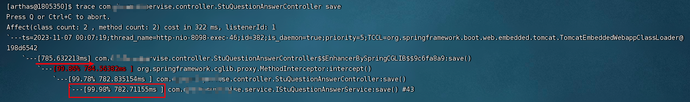
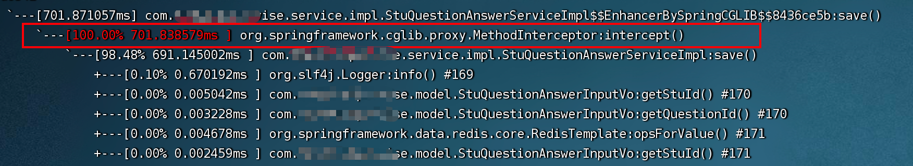
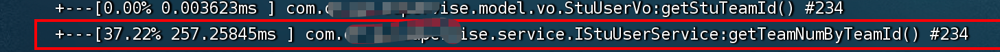
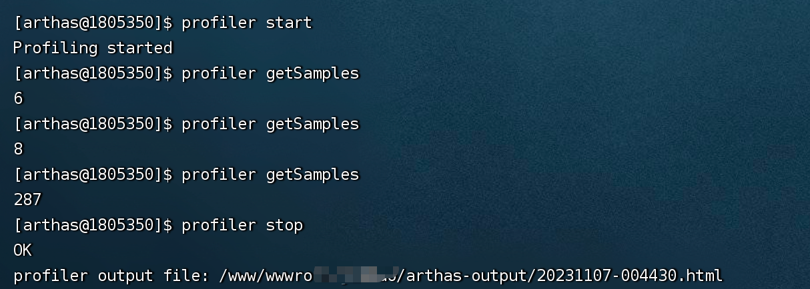
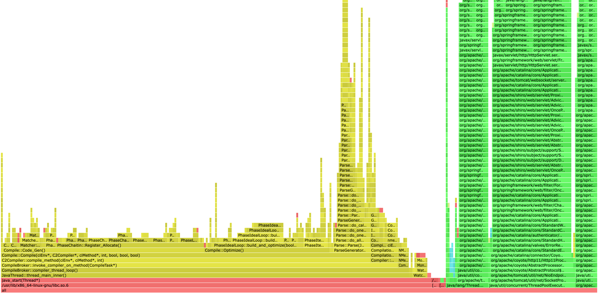

## 问题: 随着时间的增长，接口越来越慢,从1s的响应延长到10s 以上

``` java
@PostMapping(path="/saveAnswer")
public String saveAnswer(@RequestBody AnswerInputo answerInputo){
    System.out.println("start save");
    answerService.check(answerInputo);
    answerService.saveRecord(answerInputo);
    answerService.createOrder(answerInputo);
    answerService.save(answerInputo);
    System.out.println("end save");
    return "SUCCESS";
}
```

## 最初的想法是：添加日志,重新发版本

``` java
@PostMapping(path="/saveAnswer")
public String saveAnswer(@RequestBody AnswerInputo answerInputo){
    System.out.println("start save");
    answerService.check(answerInputo);
    log.info("start-01:",System.time())
    answerService.saveRecord(answerInputo);
    log.info("start-02:",System.time())
    answerService.createOrder(answerInputo);
    log.info("start-03:",System.time())
    answerService.save(answerInputo);
    log.info("start-01:",System.time())
    System.out.println("end save");
    return "SUCCESS";
}
```
### 这样的问题：
1. 添加的无用日志太多；
2. 容易漏,导致关键的位置没有分析到；
3. 因为此类问题大部分都是生产发现,线上如果调试,就需要不断发布,影响用户使用；

## 使用 Arthas

``` java
java -jar arthas-boot.jar
```
根据提示，选择对应的java应用。


### trace 命令指定追踪的类和方法
输入要追踪的类和方法。输入格式为：trace {全限定类名} {方法名}：
``` java
trace com.**.****.controller.StuQuestionAnswerController save
``` 
#### 定位耗时部分
1. 访问下controller中的callServices这个方法。这个时候arthas控制台有如下输出：


定位到service;

2. trace 命令service的方法。
```java
trace com.**.****.service.IStuQuestionAnswerService save
```




一目了然，可以看到是getTeamNumByTeamId() 方法耗时占比37%以上。

### trace 结合OGNL表达式 命令指定追踪的类和方法

OGNL表达式，支持各种复杂的嵌套结构及比较逻辑.

#### 根据参数筛选： 入参第一个参数等于 dd
``` java
trace com.**.****.controller.StuQuestionAnswerController save "params[0].equals(\"dd\")" "
``` 

#### 根据运行时间筛选：耗时大于800ms
``` java
trace com.**.****.controller.StuQuestionAnswerController save "#cost > 800"
``` 

## arthas 采集火焰图

### 开始采集
```
 profiler start
```
### 查看采集的样本数量
```
 profiler getSamples
```
### 停止采样
```
 profiler stop
```



### 结果



【**纵轴(Y轴)**】表示的是方法调用的调用栈信息，即从最外层方法到最内层方法的调用信息。

【**横轴(X轴)**】表示的是方法调用的持续时间，即方法在执行过程中所占用的时间长度。

在一个火焰图中，越靠近下面的函数在x轴上越长是正常的，而越往上的函数就应该越短。所以，火焰图也像是一个个山峰。那么，如果火焰图出现较宽的峰顶，那就往往是性能瓶颈。