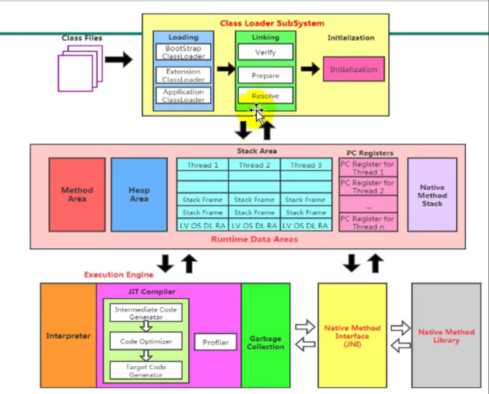

# 图示


# JVM 内存区域

内存是非常重要的系统资源，是硬盘和CPU 的中间仓库及桥梁，承载着操作系统和应用的实时运行。
JVM 内存布局规定了Java 在运行过程中内存申请、分配、管理的策略， 保证了JVM 的高效稳定运行。
不同的JVM 对于内存的划分方式和管理机制存在着部分差异。结合JVM 虚拟机规范，来探讨一下经典的JVM
内存布局。

## 线程
每个JVM 只有一个Runtime 实例。即为运行时环境。

线程是一个程序里的运行单元。JVM 允许一个应用有多个线程并行的执行。

在Hopsopt JVM 中，每个线程都与操作系统的本地线程直接映射。
   >当一个Java线程准备好执行以后，此时一个操作系统的本地线程也同时创建。Java 线程执行终止后,本地线程也会回收。

操作系统负责所有线程的安排调度到任何一个可用的CPU 上。一旦本地线程初始化成功个，它就会调用Java 线程中的run()方法。
### 守护线程、普通线程
 

## 一、程序计算器

极小的内存空间,线程私有的,当前线程的行号指示器，程序的分支、循环、跳转、异常处理、线程恢复等基本功能都需要依赖程序计算器；比如(多线程切换)。

线程执行的是:</br>
1. Java方法，计数器记录的是正在执行的虚拟机字节码指令的地址；</br>
2. Native方法，计数器值为空；值得注意的是它是java虚拟机规范中唯一没有规定任何OutOfMemoryError情况的区域

## 二、java虚拟机栈

1. 虚拟机栈描述的是java方法执行的内存模型：线程私有的，生命周期与线程相同。</br>

2. 每个方法在执行的同时都会创建一个栈帧用于 存储局部变量表、操作数栈、动态链接、方法出口等信息；方法的调用直至执行完成的过程，对应着栈帧在虚拟机栈中入栈到出栈的过程。

3. 虚拟机栈主要的部分是**局部变量表** ，其存放了编译器可知的各种基本数据类型、对象引用和returnAddress类型(指向了一条字节码指令的地址);

4. 局部变量表所需的内存空间在编译期间完成分配，在方法运行期间不会改变局部变量表的大小。

5. 如果线程请求的栈深度大于虚拟机所允许的深度，将抛出StackOverflowError异常；如果虚拟机可以动态扩展，如果扩展时无法申请到足够的内存，将会抛出OutOfMemoryErro异常。

## 三、本地方法栈

与虚拟机栈作用类似，本地方法栈是虚拟机栈使用到的Native方法服务；SunHotSpot虚拟机把本地方法栈和虚拟机栈结合; 本地方法栈也会报虚拟机栈的两种异常。

## 四、java堆

1. java虚拟机管理的最大的一块内存；

2. 所有线程共享的内存区域；

3. 目的：存放对象实例，几乎所有的对象实例都在这里分配内存；（所有的对象实例以及数组都要在堆上分配）特别注意的是： 随着JIT编译器的发展与逃逸分析技术的成熟，栈上分配、标量替换优化技术带来了变化。不是所有对象都在堆上分配内存了。

4. java虚拟机规范规定，java堆可以处于物理上不连续的内存空间中，只要逻辑上是连续的即可；实现时，即可是固定大小的，也可是可扩展的；当前主流的虚拟机都是可扩展的，通过-Xmx和-Xms控制； 如果堆中没有内存，并且堆也无法扩展 ，抛出OutOfMemoryError异常。

5. java堆是垃圾收集的主要区域，也称为“GC堆”;

   . 从内存回收的角度：基本采用分代收集算法，java堆分为新生代(Eden空间、From Survivor空间、To Survivor空间)和老年代；
   . 从内存分配的角度：线程共享的java堆中可能划分出多个线程私有的分配缓冲区。目的是为了更好地、更快地回收内存。

## 五、方法区

1. 存储已被虚拟机加载的类信息、常量、静态变量、即时编译器编译后的代码等数据。
2. 所有线程共享的内存区域。
3. 在HostSpot虚拟机中，使用永久代来实现方法区，这样的话垃圾收集器可以像管理Java堆一样管理这部分内存； Jdk1.7中，永久代中的字符串常量池移出。 为Native Memory实现方法区做准备。
4. 方法区和java堆一样不需要连续的内存和可以选择固定大小或者可扩展外，还可以选择不实现垃圾收集；垃圾收集行为在方法区较少出现，方法区的内存回收目标主要是针对常量池的回收和对类型的卸载；（回收效果差，类型卸载要求高）回收非常有必要，当方法区无法满足内存分配需求时，将抛出OutOfMemoryError异常。

## 六、运行时常量池

1. 方法区的一部分;
2. 存放的是类加载后class文件中常量池的信息;Class文件包括： 1 常量池(用于存放编译器生成的各种字面量和符号引用，这部分内容在类加载后存放到方法区的运行时常量池中) 2 类的基本描述信息（字段、方法、接口）

运行时常量池，细节要求不高，可以根据不同的需求来实现该内存区域； Class包括其中的常量池，格式要求严格，具体到每一个字节存储的数据都必须符合才能被虚拟机认可、装载和执行；运行时常量池，不仅保存Class文件中描述的符号引用，而且也保存翻译的直接引用。

java语言的动态性，意味着并不要求常量一定只有编译器才能产生，也就是说不是只有提前放置在Class文件常量池中的内容才能进入方法区的运行时常量池； 在运行期也可以将新的常量放入运行时常量池，比如String的intern（）方法(调用该方法，如果常量池中包含了一个和当前对象相等的字符串则返回常量池中的字符串， 否则把改字符串放到常量池中，并返回字符串的引用.)；常量池可能报OutOfMemoryError异常。

常量池在运行时加载到内存中后,称为运行时常量池。
## 七、直接内存

1. NIO类，一种基于通道与缓存区的I/o方式，可以使用Native函数库直接分配堆外内存，通过存储在java堆中的DirectByteBuffer对象作为这块内存的引用；
2. NIO的使用在某些场合避免了在java堆和Native堆中来回复制数据，提高了性能；
3. 直接内存不受java堆大小的控制，但是受到本机总内存大小以及处理器寻址空间的限制；
4. 也是会报OutOfMemoryError异常。

# 知识补充：
## 逃逸分析
目的就是减少内存堆分配压力；

逃逸分析(Escape Analysis)是目前Java虚拟机中比较前沿的优化技术。

逃逸分析的基本行为就是分析对象动态作用域：当一个对象在方法中被定义后，它有可能被外部方法所引用，例如，作为调用参数传递到其他地方中，称为方法逃逸。
### 基于逃逸分析，可以进行 同步消除、栈上分配以及标量替换的优化。
### 例子：
```
    public static StringBuffer craeteStringBuffer(String s1, String s2) {
        StringBuffer sb = new StringBuffer();
        sb.append(s1);
        sb.append(s2);
        return sb;
    }
```
StringBuffer sb是一个方法内部变量，上述代码中直接将sb返回，这样这个StringBuffer有可能被其他方法所改变，这样它的作用域就不只是在方法内部，虽然它是一个局部变量，称其逃逸到了方法外部
。甚至还有可能被外部线程访问到，譬如赋值给类变量或可以在其他线程中访问的实例变量，称为线程逃逸。

上述代码如果想要StringBuffer sb不逃出方法，可以做一些修改：

```
    public static StringBuffer craeteStringBuffer(String s1, String s2) {
        StringBuffer sb = new StringBuffer();
        sb.append(s1);
        sb.append(s2);
        String result = sb.toString();
        return result;
    }
```

逃逸分析包括：

+ 全局变量赋值逃逸
+ 方法返回值逃逸
+ 实例引用发生逃逸
+ 线程逃逸：赋值给类变量或可以在其他线程中访问的实例变量

```
public class EscapeAnalysis {
 
     public static Object object;
     
     public void globalVariableEscape(){   //全局变量赋值逃逸  
         object =new Object();  
      }  
     
     public Object methodEscape(){    //方法返回值逃逸
         return new Object();
     }
     
     public void instancePassEscape(){   //实例引用发生逃逸
        this.speak(this);
     }
     
     public void speak(EscapeAnalysis escapeAnalysis){
         System.out.println("Escape Hello");
     }
}
```

## 同步消除(锁消除)
如果一个对象被发现只能从一个线程被访问到，那么对于这个对象的操作可以不考虑同步。

在动态编译同步块的时候，JIT编译器可以借助逃逸分析来判断同步块所使用的锁对象是否只能够被一个线程访问而没有被发布到其他线程。

如果同步块所使用的锁对象通过这种分析被证实只能够被一个线程访问，那么JIT编译器在编译这个同步块的时候就会取消对这部分代码的同步。这个取消同步的过程就叫同步省略，也叫锁消除。

虚拟机会根据自己的代码检测结果取消一些加锁逻辑。

虚拟机通过检测会发现一些代码中不可能出现数据竞争，但是代码中又有加锁逻辑，为了提高性能，就消除这些锁。

如果一段代码中，在堆上的所有数据都不会被其他线程访问到，那就可以把它们当成线程私有数据，自然就不需要同步加锁了。

### 经典例子：
String 字符串拼接：
```
    String a = "hello";
    String b = "world";
    String c = a+b;
```
打开编译后的字节码我们可以发现加号拼接字符串jvm底层其实是调用StringBuilder来实现的，也就是说”a” + “b”等效于下面的代码片。
```
    String a = "a";
    StringBuilder sb = new StringBuilder();
    sb.append(a).append("b");
    String c = sb.toString();
```
append方法时一个同步方法，它的方法签名是：
```
    public synchronized StringBuffer append(String str);
```
这时候，编译器就会判断出sb这个对象并不会被这段代码块以外的地方访问到，更不会被其他线程访问到，这时候的加锁就是完全没必要的，编译器就会把这里的加锁代码消除掉，
体现到java源码上就是把append方法的synchronized修饰符给去掉了。


## 栈上分配
1. 虚拟机提供的一种优化技术，基本思想是，对于线程私有的对象，将它打散分配在栈上，而不分配在堆上。好处是对象跟着方法调用自行销毁，不需要进行垃圾回收，可以提高性能。
2. 栈上分配需要的技术基础，逃逸分析。逃逸分析的目的是判断对象的作用域是否会逃逸出方法体。注意，任何可以在多个线程之间共享的对象，一定都属于逃逸对象。
3. 如果逃逸分析能够证明某些新建的 **对象不逃逸** ，那么 Java 虚拟机完全可以将其分配至栈上，并且在 new 语句所在的方法退出时，通过弹出当前方法的栈桢来自动回收所分配的内存空间。

## 标量替换
定义：通过逃逸分析确定该对象不会被外部访问，并且对象可以被进一步分解时，JVM不会创建该对象，而会将该对象成员变量分解若干个被这个方法使用的成员变量所代替。这些代替的成员变量在栈帧或寄存器上分配空间。

```
    public static void main(String[] args) {
       alloc();
    }
     
    private static void alloc() {
       Point point = new Point（1,2）;
       System.out.println("point.x="+point.x+"; point.y="+point.y);
    }
    class Point{
        private int x;
        private int y;
    }
```
以上代码中，point对象并没有逃逸出alloc方法，并且point对象是可以拆解成标量的。那么，JIT就会不会直接创建Point对象，而是直接使用两个标量int x ，int y来替代Point对象。

以上代码，经过标量替换后，就会变成：

```
    private static void alloc() {
       int x = 1;
       int y = 2;
       System.out.println("point.x="+x+"; point.y="+y);
    }
```
减少堆内存的占用。因为一旦不需要创建对象了，那么就不再需要分配堆内存了。

标量替换为栈上分配提供了很好的基础。

由于该对象没有被实际分配，因此和栈上分配一样，它同样可以减轻垃圾回收的压力。与栈上分配相比，它对字段的内存连续性不做要求，而且，这些字段甚至可以直接在寄存器中维护，无须浪费任何内存空间。


[toc]

# 类的生命周期


# 过程
## 加载（load）
1. 通过一个类的全限定名来获取定义此类的二进制字节流；
2. 将这个字节流所代表的静态存储结构转化为方法区的运行时数据结构；
3. <font color=#FF0000 >在内存中生成一个代表这个类的java.lang.Class对象</font>，作为方法区这个类的各种数据的访问入口。
### 加载方式：
1. 从zip包中读取，扩展而来的是Jar、Ear、war格式；
2. 从网络中获取，比如Applet;
3. 运行时计算生成，比如动态代理技术；
4. 由其他文件生成，比如JSP;
5. 从数据库中读取，比如某些中间件服务器，如SAP;
6. 从本地系统中直接加载；
7. 从加密文件中获取，典型的防Class文件被反编译的保护措施；
## 链接(Linking)
### 校验
目的是在于确保class文件的字节流中包含信息符合当前虚拟机要求，保证被加载类的正确性，不会危害虚拟机自身安全。</br>
主要包括四种验证： 文件格式验证、元数据验证、字节码验证、符号引用验证。
### 准备
为类变量分配内存并且设置该类变量的默认初始值，即零值。</br>
这里不包含用final 修饰的static，因为final 在编译的时候就会分配了,准备阶段会显示初始化；</br>
这里不会为实例变量分配初始化，类变量会分配在方法去中，而实例变量是会随着对象一起分配到JAVA堆中。</br>
### 解析
虚拟机将常量池内的符号引用替换为直接引用的过程。</br>
事实上，解析操作往往会伴随着JVM 在执行完初始化之后再执行;</br>
符号引用以一组符号来描述所引用的目标，符号可以是任何形式的字面量，只要使用时能无歧义地定位到目标即可。
各虚拟机能接受的符号引用必须是一致的，因为符号引用的字面量形式明确定义在Java虚拟机规范的Class文件格式中。</br>
直接引用可以是直接指向目标的指针、相对偏移量或是一个能间接定位到目标的句柄。</br>
解析动作主要针对类或接口、字段、类方法、接口方法、方法类型等。对应常量池中的CONSTANT_Class_info、CONSTANT_Fieldref_info、
CONSTANT_Methodref_info等。

对同一个符号引用进行多次解析是可能的，所以虚拟机会被第一次解析的结果进行缓存，避免解析动作重复进行。
## 初始化
真正开始执行类中定义的Java程序代码(或者说是字节码)；</br>
根据程序员通过程序制定的主观计划去初始化类变量和其他资源。换个角度来说，初始化阶段是执行类构造器<clinit>()方法的过程。
clinit 方法不需要定义，是Javac 编译器自动收集类中的所有类变量的赋值动作和静态代码块中的语句合并而来。</br>
构造器方法中指令按语句在源文件中出现的顺序执行。</br>
<clinit>()不同于类的构造器。(关联: 构造器是虚拟机视角下的<init>())</br>
若该类具有父类，JVM 会保证子类的<clinit>()执行钱，父类的<clinit>()已经执行完毕。</br>
虚拟机必须保证一个类的<clinit>()方法在多线程下被同步加锁。

### 初始化时机：
虚拟机规范规定了有且只有5中情况下，必须立即对类进行初始化，称为对一个类进行主动引用；
1. 遇到new、getstatic、putstatic 或invokestatic 这四条字节码指令时，如果类没有进行过初始化，则需要先触发其初始化。
场景： 使用new关键字实例化对象的时候、读取或设置一个类的静态字段(被final修饰，已在编译器把结果放入常量池的静态字段除外)的时候，以及调用一个类的静态方法的时候，
2. 使用java.lang.reflect 包的方法对类进行反射调用的时候，如果类没有进行过初始化，则需要先触发其初始化
3. 当虚拟机启动时，用户需要指定一个要执行的主类(包含main()方法的那个类),虚拟机会先初始化这个主类；
4. 当初始化一个类时，如果发现其父类还没有进行过初始化，则需要先触发其父类的初始化；
如果初始化的是一个接口，并不要求其父接口全部都完成了初始化，只有在真正使用到父接口的时候，才会初始化。比如(引用接口中定义的常量)
5. 当使用JDK 1.7 的动态语言支持时，如果一个java.lang.invoke.MethodHandle实例最后的解析结果REF_getStatic、REF_putStatic、REF_invokeStatic的方法句柄，并且这个方法句柄所对应的类没有进行过初始化，则需要先触发其初始化。
除了在加载阶段用户应用程序可以通过自定义类加载器参与之外，其余动作完全由虚拟机主导和控制，到了初始化，才开始执行Java程序代码。

## 例子：


# 类加载器

实现“通过一个类的全限定名来获取描述此类的二进制字节流”的动作的代码模块；

## 类加载器从两个角度区分:

一、从虚拟机角度：   
   
1. 启动类加载器(BootStrap ClassLoader),由C++语言实现，虚拟机自身的一部分；
2. 所有其他的类加载器，由Java语言实现，独立于虚拟机外部，并且全部继承自抽象类Java.lang.ClassLoader。

二、从Java开发角度：

1. 启动类加载器；
2. 扩展类加载器；
3. 应用程序类加载器。

## 类加载器的作用


类加载器负责从本地文件系统或者网络中获取class文件，class 文件在文件开头有特殊的标识;
ClassLoader 只负责class文件系统的加载，至于它是否运行，则由ExcutionEngin 决定;
加载的类信息存储于一块称为方法区的内存空间。除了类的信息，方法区中还会存放运行时常量池信息，可能还会有字符串字面量和数字常量(这部分常量信息是class中常量池部分的内存映射).


1. class file 存在于文件系统中，可以理解为设计师画在纸上的模板，而最终这个模板执行的时候是要加载进入JVM根据这个文件实例化出N个一模一样的实例。
2. class file 被加载进入JVM中，被称为 DNA 元数据模板，放在方法区；
3. 在.class -> JVM -> 元数据模板，这就需要一个工具(类加载器 ClassLoader 扮演的角色)

## 介绍三种类加载器
### 启动类加载器(Bootstrap ClassLoader)

工作：

+ 将存放在<JAVA_HOME>\lib 目录中的rt.jar，或者被-Xbootclasspath参数所指定的路径中的，并且是虚拟机识别的类库加载到虚拟机内存中。
>>（仅按照文件名识别，如rt.jar，名字不符合的类库即使放在lib目录中也不会被加载）
+ 启动类加载器无法被Java程序直接引用，用户在编写自定义类加载器时，如果需要把加载请求委派给引导类加载器，那直接使用null代替即可。
+ 加载扩展类和应用程序类加载器，并制定为他们的父类加载器。
+ 不继续自Java.lang.ClassLoader,没有父加载器。

### 扩展类加载器(Extension ClassLoader)

+ **实现类**:  sum.misc.Launcher$ExtClassLoader

+ **工作**:  加载<JAVA_HOME>\lib\ext 目录中的或被Java.ext.dirs系统变量所指定的路径中的所有类库;开发者可以直接使用扩展类加载器。
+ 如果用户创建的JAR放在次目录下,也会自动由扩展类加载器加载。

### 应用程序类加载器(Application ClassLoader)

+ **实现类**: sum.misc.Launcher $AppClassLoader

+ **工作**: 加载用户类路径上所指定的类库  开发者可以直接使用这个类加载器，如果应用程序中没有自定义过自己的类加载器，一般情况下这个就是程序中默认的类加载器。

+ **由来**: 是ClassLoader中的getSystemClassLoader()方法的返回值，所以也可以称之为系统类加载器。

+ **总结**:  应用程序都是由这3中类加载器相互配合进行加载的，如果必要，可以加入自定义的类加载器。

## 自定义类加载器
### 为什么要自定义类加载器
+ 隔离加载类
+ 修改类加载的方式
+ 扩展加载源
+ 防止源码泄露

## 类加载器之间的关系

### 双亲委派模型

定义：
+ 类加载器之间的这种层次关系，称为类加载器的双亲委派模型。一种类加载器的实现方式。

特点：
+ 双亲委派模型要求除了顶层的启动类加载器外，其余的类加载器都应当有自己的父类加载器。

类加载器之间的关系：

+ 一般不会以继承的关系来实现，而都是使用组合关系来复用父加载器的代码。

工作过程:

>>如果一个类加载器收到了类加载的请求，它首先不会自己去尝试加载这个类，而是把这个请求委派给父类加载器去完成，每一个层次的类加载器都是如此，</br>
> 因此所有的加载请求最终都应该传送到顶层的启动类加载器中，只有当父类加载器反馈自己无法完成这个加载请求时(它的搜索范围中没有找到所需的类)，子加载器才会尝试自己去加载。

工作原理图：


好处：

Java类随着它的类加载器一起具备了一种带有优先级的层次关系。

避免类的重复加载;

保护程序安全，防止核心API 被随意篡改；

>> 比如：
        类Object，它在rt.jar中，无论哪一个类加载器要加载这个类，最终都是要委派给处于模型最顶端的启动类加载器进行加载，因此Object类在程序的各种类加载器环境中都是同一个类。
+ 实现简单：

>> Java.lang.ClassLoader的loadClass()方法中；

+ 实现逻辑:

>> 首先检查是否已经被加载过，若没有加载则调用父加载器的loadClass()方法，若父加载器为空则默认使用启动类加载器作为父加载器。</br>
> 如果父类失败，抛出ClassNotFoundException异常后，再调用自己的findClass()方法进行加载。

结果：

+ 解决了各个类加载的基础类的统一问题；

## 局限性

### 破坏双亲委派模型

因为双亲委派模型的局限性，出现了三次，两个不同的加载器。

### 一、无法解决基础类回调用户的代；

例子：
+ 比如JNDI服务，JNDI服务由启动类加载器去加载，但JNDI的目的就是对资源进行集中管理和查找，它需要调用由独立厂商实现并部署在应用程序的ClassPath下的JNDI接口提供者的代码。

问题：
+ 启动类加载器不认识JNDI接口提供者的代码；
+ JNDI服务使用线程上下文类加载器去加载所需要的的SPI代码，也就是父类加载器请求子类加载器去完成类加载的动作，这种行为打破了双亲委派模型的层次接口来逆向使用类加载器。

解决：
+ 线程上下文类加载器。
+ 线程上下文类加载器可以通过Java.lang.Thread类的setContextClassLoader()方法进行设置，如果创建线程时还未设置，它将从父线程中继承一个，如果在应用程序的全局范围内都没有设置过的话，那这个类加载器默认就是应用程序类加载器。

Java中所有涉及SPI的加载动作基本上都采用这种方式，如JDNI、JDBC、JCE、JAXB和JBI等。

### 二、用户对程序动态性的追求。

说明：
+ 动态性指： 代码热替换、模块热部署等。
+ 
解决：

+ OSGI
>> 程序模块在OSGI中称为Bundle。
OSGI 实现模块化热部署的关键则是它自定义的类加载器机制的实现。</br>
> 每一个程序模块都有一个自己的类加载器，当需要更换一个程序模块时，就把程序模块连同类加载器一起换掉以实现代码的热替换。</br>
OSGI环境下，类加载器为复杂的网状结构。
> 
+ OSGI的请求过程：当收到类加载请求时：

  1. 将以java.*开头的类委派给父类加载器加载；
  2. 否则，将委派列表名单内的类委派给父类加载器加载；
  3. 否则，将Import列表中的类委派给Export这个类的Bundle的类加载器加载；
  4. 否则，查找当前Bundle的ClassPath,使用自己的类加载器加载;
  5. 否则，查找类是否在自己的Fragmentg Bundle中，如果在，则委派给Fragment Bundle的类加载器加载；
  6. 否则，查找Dynamic Import 列表的Bundle，委派给对应Bundle的类加载器加载;
  7. 否则，类查找失败。

### 三、自定义类加载器的原则：

用户可以把自己的类加载逻辑写到findClass()方法中，在loadClass()方法的逻辑里如果父类加载失败，则会调用自己的findClass()方法来完成加载，这样就可以保证新写出来的类加载器是符合双亲委派规则的。

## 知识补充
### 沙箱安全机制


### 比较两个Class 对象是否为同一个类:

在JVM 中表示两个class对象是否为同一个类存在两个必要条件：
  + 类的完整类名必须一致，包括包名。
  + 加载这个类的ClassLoader(指ClassLoader 实例对象)必须相同。

换句话说，在JVM 中，即使这两个类对象(class对象)来源同一个class文件，被同一个虚拟机所加载，但只要加载他们的classLoader 实例对象不同，
那么这两个类对象也是不相等的。 

JVM 必须知道一个类型是由启动加载器加载的还是由用户类加载器加载的。如果一个类型是由用户类加载器加载的，那么JVM 会将这个类加载器的一个引用作为
类型信息的一部分保存在方法区中。当解析一个类型到另一个类型的引用的时候，JVM 需要保证这两类型的类加载器是相同的。

### 类的主动使用和被动使用


// .vuepress/config.ts
import { defineUserConfig } from "vuepress";
import { hopeTheme } from "vuepress-theme-hope";

export default defineUserConfig({
  theme: hopeTheme({
    plugins: {
      mdEnhance: {
        // 这就是默认选项，所以你可以直接使用它
        container: true,
      },
    },
  }),
});
