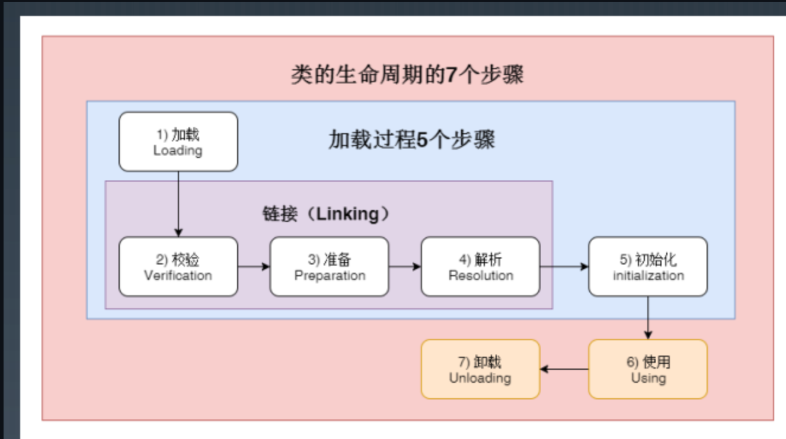
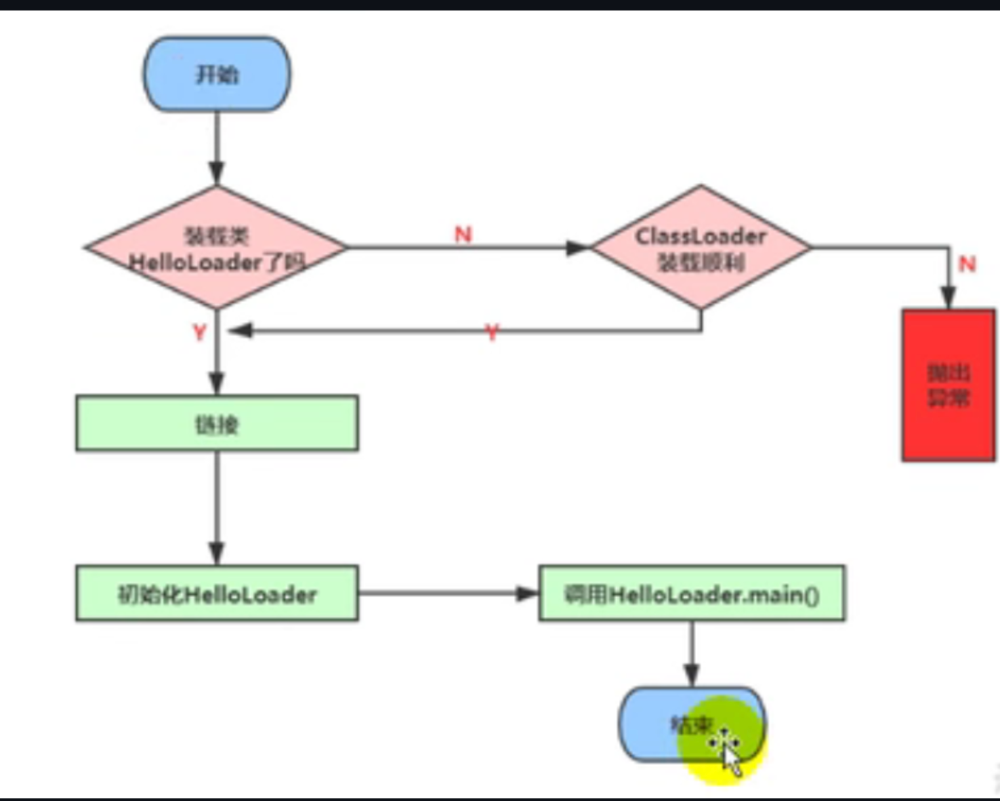

# 类的生命周期

# 过程
## 加载（load）
1. 通过一个类的全限定名来获取定义此类的二进制字节流;
2. 将这个字节流所代表的静态存储结构转化为方法区的运行时数据结构;
## 链接(Linking)
### 校验
目的是在于确保class文件的字节流中包含信息符合当前虚拟机要求，保证被加载类的正确性，不会危害虚拟机自身安全。  
主要包括四种验证：文件格式验证、元数据验证、字节码验证、符号引用验证。
### 准备
为类变量分配内存并且设置该类变量的默认初始值，即零值。   
这里不包含用final 修饰的static，因为final 在编译的时候就会分配了,准备阶段会显示初始化；    
这里不会为实例变量分配初始化，类变量会分配在方法去中，而实例变量是会随着对象一起分配到JAVA堆中.
### 解析
虚拟机将常量池内的符号引用替换为直接引用的过程。  
事实上，解析操作往往会伴随着JVM 在执行完初始化之后再执行;   
符号引用以一组符号来描述所引用的目标，符号可以是任何形式的字面量，只要使用时能无歧义地定位到目标即可。
各虚拟机能接受的符号引用必须是一致的，因为符号引用的字面量形式明确定义在Java虚拟机规范的Class文件格式中。   
直接引用可以是直接指向目标的指针、相对偏移量或是一个能间接定位到目标的句柄。   
解析动作主要针对类或接口、字段、类方法、接口方法、方法类型等。对应常量池中的CONSTANT_Class_info、CONSTANT_Fieldref_info、
CONSTANT_Methodref_info等。

对同一个符号引用进行多次解析是可能的，所以虚拟机会被第一次解析的结果进行缓存，避免解析动作重复进行。
## 初始化
真正开始执行类中定义的Java程序代码(或者说是字节码)；   
根据程序员通过程序制定的主观计划去初始化类变量和其他资源。换个角度来说，初始化阶段是执行类构造器<clinit>()方法的过程。
clinit 方法不需要定义，是Javac 编译器自动收集类中的所有类变量的赋值动作和静态代码块中的语句合并而来。   
构造器方法中指令按语句在源文件中出现的顺序执行。   
<clinit>()不同于类的构造器。(关联: 构造器是虚拟机视角下的<init>())   
若该类具有父类，JVM 会保证子类的<clinit>()执行钱，父类的<clinit>()已经执行完毕。   
虚拟机必须保证一个类的<clinit>()方法在多线程下被同步加锁。

### 初始化时机：
虚拟机规范规定了有且只有5中情况下，必须立即对类进行初始化，称为对一个类进行主动引用；
1. 遇到new、getstatic、putstatic 或invokestatic 这四条字节码指令时，如果类没有进行过初始化，则需要先触发其初始化。
场景： 使用new关键字实例化对象的时候、读取或设置一个类的静态字段(被final修饰，已在编译器把结果放入常量池的静态字段除外)的时候，以及调用一个类的静态方法的时候，2. 使用java.lang.reflect 包的方法对类进行反射调用的时候，如果类没有进行过初始化，则需要先触发其初始化
3. 当虚拟机启动时，用户需要指定一个要执行的主类(包含main()方法的那个类),虚拟机会先初始化这个主类；
4. 当初始化一个类时，如果发现其父类还没有进行过初始化，则需要先触发其父类的初始化；
如果初始化的是一个接口，并不要求其父接口全部都完成了初始化，只有在真正使用到父接口的时候，才会初始化。比如(引用接口中定义的常量)
5. 当使用JDK 1.7 的动态语言支持时，如果一个java.lang.invoke.MethodHandle实例最后的解析结果REF_getStatic、REF_putStatic、REF_invokeStatic的方法句柄，并且这个方法句柄所对应的类没有进行过初始化，则需要先触发其初始化。
除了在加载阶段用户应用程序可以通过自定义类加载器参与之外，其余动作完全由虚拟机主导和控制，到了初始化，才开始执行Java程序代码。

## 例子：
