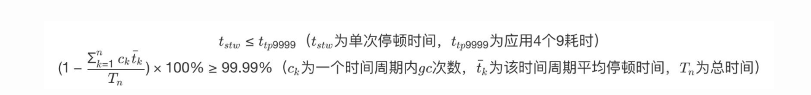

# GC的两个核心指标
## 延迟(Latency):  
最大停顿时间，即垃圾收集过程中一次STW的最长时间，越短越好，一定程度上可以接受频次的增大.
### 吞吐量(Throughput):
应用系统的生命周期内，由于GC线程会占用应用程序当前可用的CPU 时钟周期，吞吐量即为应用程序有效花费的时间占系统总运行时间的百分比。  
例如： 系统运行了100min,GC耗时1min,则系统吞吐量为99%,吞吐量优先的收集器可以接受较长的停顿。

# p99 图示

p99 即为**一次停顿的时间不超过应用服务的 TP9999，GC 的吞吐量不小于 99.99%**。  
## 例子：
假设某个服务 A 的 TP9999 为 80 ms，平均 GC 停顿为 30 ms，那么该服务的最大停顿时间最好不要超过 80 ms，GC 频次控制在 5 min 以上一次。如果满足不了，那就需要调优或者通过更多资源来进行并联冗余。  
1/10000 = (1(次数)* x (平均GC停顿时间)) /  y(总时间)   
5min 等于 5*60*1000 = 300000毫秒；30 /300000= 1/10000

# 引入
[服务器的性能参数](09002_ServerPerformanceParameters.md)
