---
title: mysql order by 优化 | 分析
subtitle: order by 的分析之路
category:
  - mysql
tag:
  - 摸鱼
order: 0.1
---

# Mysql 优化

# ****order by 语句怎么优化？****

### 例子

### 表结构：

```java
CREATE TABLE `sys_user` (
  `user_id` bigint NOT NULL AUTO_INCREMENT COMMENT '用户ID',
  `dept_id` bigint DEFAULT NULL COMMENT '部门ID',
  `user_name` varchar(30) COLLATE utf8mb4_general_ci NOT NULL COMMENT '用户账号',
  `nick_name` varchar(30) COLLATE utf8mb4_general_ci NOT NULL COMMENT '用户昵称',
  `email` varchar(50) COLLATE utf8mb4_general_ci DEFAULT '' COMMENT '用户邮箱',
  `phonenumber` varchar(11) COLLATE utf8mb4_general_ci DEFAULT '' COMMENT '手机号码',
  `create_by` varchar(64) COLLATE utf8mb4_general_ci DEFAULT '' COMMENT '创建者',
  `create_time` datetime DEFAULT NULL COMMENT '创建时间',
  `update_by` varchar(64) COLLATE utf8mb4_general_ci DEFAULT '' COMMENT '更新者',
  `update_time` datetime DEFAULT NULL COMMENT '更新时间',
  `remark` varchar(500) COLLATE utf8mb4_general_ci DEFAULT NULL COMMENT '备注',
  PRIMARY KEY (`user_id`),
  KEY `idx_emial` (`email`) USING BTREE
) ENGINE=InnoDB AUTO_INCREMENT=101 DEFAULT CHARSET=utf8mb4 COLLATE=utf8mb4_general_ci COMMENT='用户信息表';
```

### 执行sql:

```java
explain select email,user_name,nick_name from sys_user where email = 'ry@qq.com' order by user_name limit 1000;
```

### explain的结果如下:

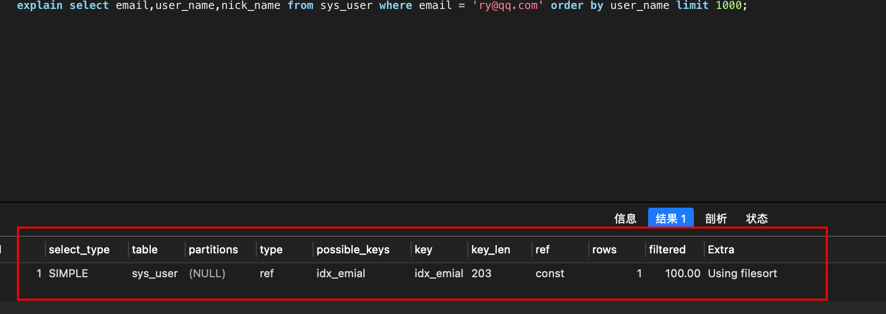
Extra列中有Using filesort说明进行了排序，**排序这个动作有可能在内存中完成，也有可能在磁盘中完成**

那么对记录根据user_name字段排序是如何做到的呢？

## 优化1:排序的字段增加索引

### 1. 增加email,user_name  作为一个联合索引。

```java
KEY `idx_email_user_name` (`email`,`user_name`) USING BTREE
```

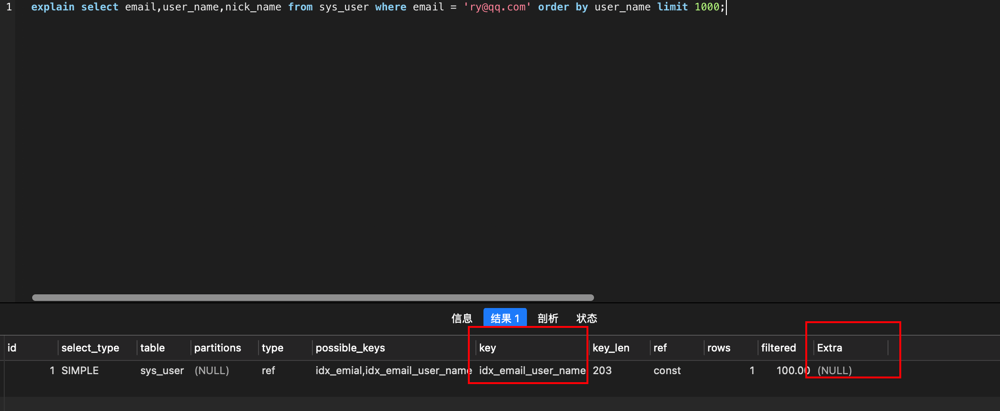

执行过程：

1. 从 索引(email,user_name) 找到第一个满足email='ry@qq.com’条件的主键id ;
2. 根据id 查找到整行数据，取出 email,user_name,nick_name  三个字段的值，作为结果集的一部分直接返回；
3. 从  索引(email,user_name) 找到下一个记录的主键id;
4. 重复步骤2，3，找到所有满足条件的记录的前1000行返回客户端

### 2. 增加email,user_name,nick_name 索引字段：

email,user_name,nick_name 作为一个联合索引；

**覆盖索引是指，索引上的信息足够满足查询请求，不需要再回到主键索引上去取数据。**

```java
KEY `idx_email_user_name` (`email`,`user_name`,`nick_name`) USING BTREE
```
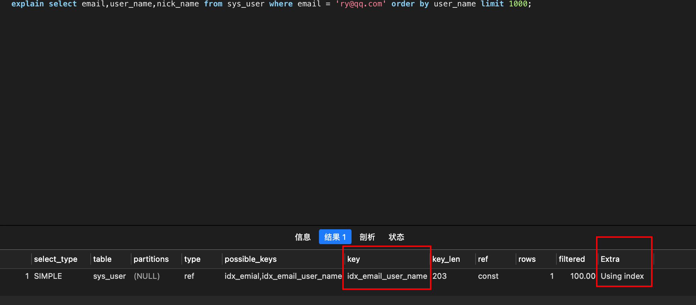

执行过程：

1. 从 索引(email,user_name,nick_name) 找到第一个满足email='ry@qq.com’条件的记录，取出 email,user_name,nick_name  三个字段的值，作为结果集的一部分直接返回；
2. 从  索引(email,user_name,nick_name) 找到下一个记录，取出 email,user_name,nick_name  三个字段的值，作为结果集的一部分直接返回;
3. 重复步骤2，3，找到所有满足条件的记录的前1000行返回客户端

当然，在实际过程中不可能为了每个查询都是用覆盖索引，把语句涉及到的字段都加上索引，因为索引的维护也是需要代价的。这就需要根据实际情况去权衡。

# 全字段和rowid 排序：

### 查看mysql版本：

select version();

### max_length_for_sort_data

1. MySQL中专门控制用于排序的行数据的长度的一个参数。它的意思是，如果单行的长度超过这个值，MySQL就认为单行太大，要换一个算法。
2. MySQL 8.0.20 之前有用。从 8.0.20 开始， 由于优化器更改使其过时且无效；所以设置也没有用了。

show variables like '%max_length_for_sort_data%';

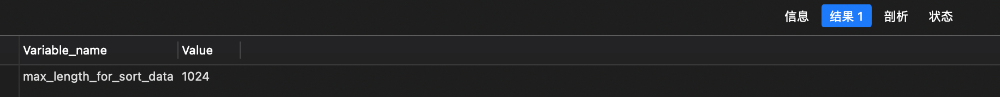
排序模式sort_mode：

- <varlen_sort_key,rowid>：使用了rowid排序模式
- <varlen_sort_key, additional_fields>：使用了全字段排序模式
- <varlen_sort_key, packed_additional_fields>：使用了打包字段排序模式（与全字段排序模式工作原理一致，不同点在于会将字段紧密的排列在一起，而不是固定长度的空间）通俗的讲就是比如：一个字段定义为VARCHAR(32)，不打包占用32字节，打包后可能占用 20字节。

## 全字段排序

把所有需要查询的字段放到内存排完序后直接返回。
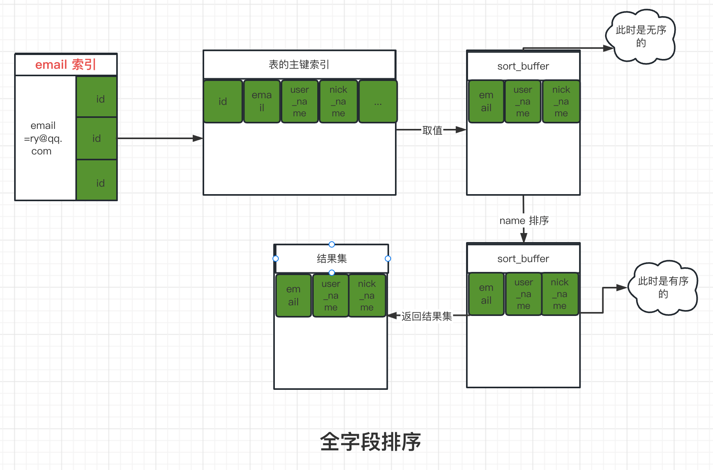


过程：

1. 初始化 sort buffer，从 email 索引找满足email=ry@qq.com 条件的主键id
2. 根据主键id回表找到对应的记录，取出 email,user_name,nick_name  三个字段的值，存入 sort buffer
3. 从 email 索引找到下一个记录的主键
4. 重复步骤2，3，找到所有满足条件的记录
5. 对 sort buffer 中的数据按照字段 user_name 排序，排序结果取前1000行返回客户端

注意：

按user_name排序这个动作，可能在内存中完成，也可能需要使用外部排序。这取决于排序需要的内存大小和 sort_buffer_size（mysql为排序开辟的内存大小，即sort buffer）的大小；如果需要的内存大小大于sort_buffer_size， 则需要利用磁盘文件排序。

### 1. 执行sql:

```sql
explain select email,user_name,nick_name from sys_user where email = '0.6694216902082988jj.qq.com' order by user_name limit 8000;
```

确保可以出现Extra中出现Using filesort：此时建议，可以去掉所有的索引，或者创建比较复杂比较多的数据。
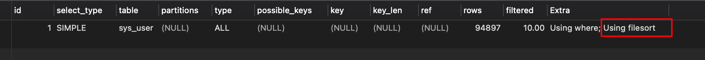

### 2. 执行trace,记得执行的sql 不要带Explain:

```sql
# 开启
SET optimizer_trace='enabled=on'; 
# 设置的大一点，让它走全字段排序
set max_length_for_sort_data = 4000;
# 执行sql;
select * from sys_user  where email = '0.6694216902082988jj.qq.com' order by user_name limit 8000;
# 执行trace
SELECT  * FROM `information_schema`.`OPTIMIZER_TRACE`;
```

### 3. 结果：

mysql 8.0.25  的结果：

```sql
{
    "select#": 1,
    "steps": [
        {
            "sorting_table": "sys_user",
            "filesort_information": [
                {
                    "direction": "asc",
                    "expression": "`sys_user`.`email`"
                },
                {
                    "direction": "asc",
                    "expression": "`sys_user`.`user_name`"
                }
            ],
            "filesort_priority_queue_optimization": {
                "limit": 8000
            },
            "filesort_execution": [],
            "filesort_summary": {
                "memory_available": 32768,
                "key_size": 161,
                "row_size": 4546,
                "max_rows_per_buffer": 7,
                "num_rows_estimate": 95943,
                "num_rows_found": 97629,
                "num_initial_chunks_spilled_to_disk": 1266,
                "peak_memory_used": 33736,
                "sort_algorithm": "std::sort",
                "sort_mode": "<fixed_sort_key, packed_additional_fields>"
            }
        }
    ]
}
```

1. 这里主要看filesort_summary即可。
2. sort_mode ： <fixed_sort_key, packed_additional_fields> 使用的打包全字段排序模式。也就是全字段排序模式；
3. num_rows_found 97629，有这么多行数据参与了排序。
4. row_size: 4546 每一行数据的大小

mysql 5.6的结果：

```sql
"filesort_summary": {
    "rows": 4546, 
    "examined_rows": 97629,
    "number_of_tmp_files": 1266,
    "sort_buffer_size": 1000,-- 排序缓存的大小，单位Byte
    "sort_mode": "<sort_key, additional_fields>" 
  } /* filesort_summary */
```

1. examined_rows: 97629, -- 参与排序的行
2. sort_mode : "<sort_key, additional_fields>" 全字段排序
3. number_of_tmp_files  -- 使用临时文件的个数，这个值如果为0代表全部使用的sort_buffer内存排序，否则使用的磁盘文件排序
4. sort_buffer_size  缓存大小

## rowid字段排序

把需要排序的字段和每一行数据对应的唯一标识[rowid]放到内存排序，然后通过rowid找到对应的数据返回。
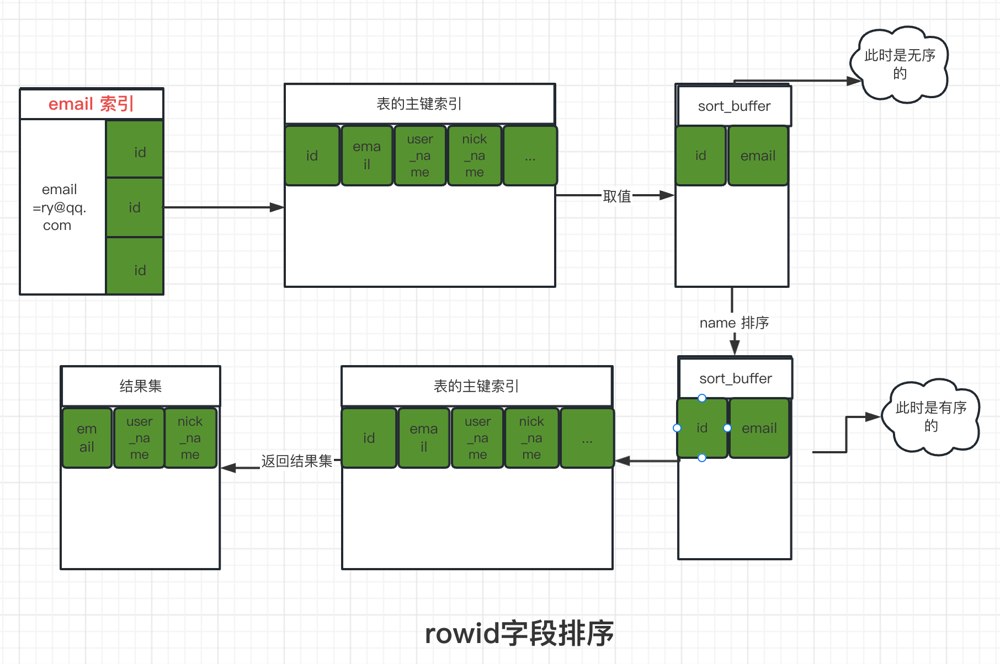


过程：

1. 初始化 sort buffer，从 email 索引找满足email=ry@qq.com 条件的主键id
2. 根据主键id回表找到对应的记录，取出 email,user_name 两个字段的值，存入 sort buffer
3. 从 email 索引找到下一个记录的主键
4. 重复步骤2，3，找到所有满足条件的记录
5. 对 sort buffer 中的数据按照字段 user_name 排序，排序结果取前1000行
6. 按照id的值回到原表中取出email,user_name和nick_name三个字段返回给客户端。

### 1. 执行sql:

```sql
explain select email,user_name,nick_name from sys_user where email = '0.6694216902082988jj.qq.com' order by user_name limit 8000;
```

确保可以出现Extra中出现Using filesort：此时建议，可以去掉所有的索引，或者创建比较复杂比较多的数据。


### 2. 执行trace,记得执行的sql 不要带Explain:

```sql
# 开启
SET optimizer_trace='enabled=on'; 
# 设置的小一点，让它走全字段排序； 这个值小于 email,user_name,nick_name 这三个值的和
set max_length_for_sort_data = 4;
# 执行sql;
select * from sys_user  where email = '0.6694216902082988jj.qq.com' order by user_name limit 8000;
# 执行trace
SELECT  * FROM `information_schema`.`OPTIMIZER_TRACE`;
```

### 3. 结果：

mysql 8.0.25  的结果,因为新版本max_length_for_sort_data不生效了，修改也无法展示rowi的排序。。：

```sql
{
    "select#": 1,
    "steps": [
        {
            "sorting_table": "sys_user",
            "filesort_information": [
                {
                    "direction": "asc",
                    "expression": "`sys_user`.`email`"
                },
                {
                    "direction": "asc",
                    "expression": "`sys_user`.`user_name`"
                }
            ],
            "filesort_priority_queue_optimization": {
                "limit": 8000
            },
            "filesort_execution": [],
            "filesort_summary": {
                "memory_available": 32768,
                "key_size": 161,
                "row_size": 4546,
                "max_rows_per_buffer": 7,
                "num_rows_estimate": 95943,
                "num_rows_found": 97629,
                "num_initial_chunks_spilled_to_disk": 1266,
                "peak_memory_used": 33736,
                "sort_algorithm": "std::sort",
                "sort_mode": "<fixed_sort_key, packed_additional_fields>"
            }
        }
    ]
}
```

1. 这里主要看filesort_summary即可。
2. sort_mode ： <fixed_sort_key, packed_additional_fields> 使用的打包全字段排序模式。也就是全字段排序模式；
3. num_rows_found 97629，有这么多行数据参与了排序。
4. row_size: 4546 每一行数据的大小

mysql 5.6的结果：

```sql
"filesort_summary": {
    "rows": 4546, 
    "examined_rows": 97629,
    "number_of_tmp_files": 1266,
    "sort_buffer_size": 1000,
    "sort_mode": "<sort_key, rowid>" 
  } /* filesort_summary */
```

1. examined_rows: 97629, -- 参与排序的行
2. sort_mode : "<sort_key, rowid>"  rowid 字段排序
3. number_of_tmp_files  -- 使用临时文件的个数，这个值如果为0代表全部使用的sort_buffer内存排序，否则使用的磁盘文件排序
4. sort_buffer_size  缓存大小

## 系统属性：

系统属性，一定要注意mysql 的版本，这些信息，在不同的版本中，有不同的问题。

### sort_buffer_size

sort_buffer_size，就是MySQL为排序开辟的内存（sort_buffer）的大小。如果要排序的数据量小于sort_buffer_size，排序就在内存中完成。但如果排序数据量太大，内存放不下，则不得不利用磁盘临时文件辅助排序。

### max_length_for_sort_data

MySQL中专门控制用于排序的行数据的长度的一个参数。它的意思是，如果单行的长度超过这个值，MySQL就认为单行太大，要换一个算法。

### tmp_table_size

tmp_table_size这个配置限制了内存临时表的大小，默认值是16M。如果临时表大小超过了tmp_table_size，那么内存临时表就会转成磁盘临时表。

## ****全字段排序 VS rowid排序：****

1. 如果MySQL实在是担心排序内存太小，会影响排序效率，才会采用rowid排序算法，这样排序过程中一次可以排序更多行，但是需要再回到原表去取数据。
2. 如果MySQL认为内存足够大，会优先选择全字段排序，把需要的字段都放到sort_buffer中，这样排序后就会直接从内存里面返回查询结果了，不用再回到原表去取数据。
3. MySQL的一个设计思想：**如果内存够，就要多利用内存，尽量减少磁盘访问。**

# 临时表排序：

### 排序算法：

1. 优先队列排序算法；（MySQL 5.6版本引入的一个新的排序算法）
2. 归并排序算法；

当explain 执行后，Extra 中出现 Using temporary 和 Using filesort；

Extra字段显示Using temporary，表示的是需要使用临时表；Using filesort，表示的是需要执行排序操作。

**对于InnoDB表来说**，执行全字段排序会减少磁盘访问，因此会被优先选择。

### 内存临时表：

**对于内存表，回表过程只是简单地根据数据行的位置，直接访问内存得到数据，根本不会导致多访问磁盘**。优化器没有了这一层顾虑，那么它会优先考虑的，就是用于排序的行越少越好了，所以，MySQL这时就会选择rowid排序。

### 磁盘临时表：

磁盘临时表使用的引擎默认是InnoDB，是由参数internal_tmp_disk_storage_engine控制的。

当使用磁盘临时表的时候，对应的就是一个没有显式索引的InnoDB表的排序过程。

## 控制参数，查看日志：

```java
set tmp_table_size=1024;
set sort_buffer_size=32768;
set max_length_for_sort_data=16;
/* 打开 optimizer_trace，只对本线程有效 */
SET optimizer_trace='enabled=on'; 

/* 执行语句 */
select word from words order by rand() limit 3;

/* 查看 OPTIMIZER_TRACE 输出 */
SELECT * FROM `information_schema`.`OPTIMIZER_TRACE`\G
```

### 计算扫描行数：

```java
/* @a保存Innodb_rows_read的初始值 */
select VARIABLE_VALUE into @a from  performance_schema.session_status where variable_name = 'Innodb_rows_read';

/* @b保存Innodb_rows_read的当前值 */
select VARIABLE_VALUE into @b from performance_schema.session_status where variable_name = 'Innodb_rows_read';

/* 计算Innodb_rows_read差值，即执行sql 扫描的行数 */
select @b-@a;
```

sort_buffer_size超过了需要排序的数据量的大小，number_of_tmp_files就是0，表示排序可以直接在内存中完成。

否则就需要放在临时文件中排序。sort_buffer_size越小，需要分成的份数越多，number_of_tmp_files的值就越大。

# 分析****执行的神器-Optimizer Trace****：

## 版本：mysql 8.0.25

## 介绍OPTIMIZER_TRACE

1. explain 可以把帮助我们看到执行计划，optimizer_trace 可以帮助我们更细致的了解
2. 一个跟踪功能，跟踪执行的语句的解析优化执行的过程，并将跟踪到的信息记录到INFORMATION_SCHEMA.OPTIMIZER_TRACE表中。
3. MySQL从5.6开始提供了相关的功能，但是MySQL默认关闭它；

## 命令：

### 查看 optimizer_trace

show variables like '%optimizer_trace%' ;
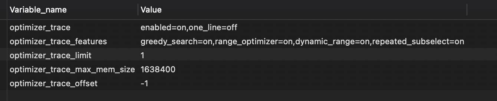

1. optimizer_trace	
    
     enabled=on,  启用/禁用optimizer_trace功能。
    
    one_line=off   决定了跟踪信息的存储方式，为on表示使用单行存储; 单行存储结果中没有空格，不能以json形式打开。不建议使用。
    
2.  optimizer_trace_features	
    1. greedy_search=on, range_optimizer=on, dynamic_range=on, repeated_subselect=on 
    2. 表示打印的信息，默认打开所有。
3. optimizer_trace_limit	
    1. 1
    2. 存储信息的条数
4. optimizer_trace_max_mem_size	
    1. 16384 optimizer_trace内存的大小，如果跟踪信息超过这个大小，信息将会被截断。
5. optimizer_trace_offset	
    1. -1
    2. 指的是查询最近的一条查询。结合3 的意思就是，optimizer_trace 中只存储最后执行的一行的结果集。

### 如何使用？

1. 开启
    1. 会话或者是全局开启；
    2. 会话开启： set session optimizer_trace='enabled=on';
    3. 全局开启： SET optimizer_trace='enabled=on';
2. 执行;一定要同时执行。
    
    ```sql
    # 执行查询语句
    select * from sys_user  order by email,user_name limit 1000;
    # 执行trace
    SELECT  * FROM `information_schema`.`OPTIMIZER_TRACE`;
    ```
    
3. 结果展示,整个分为3个阶段：
    1. join_preparation(准备阶段)
    2. join_optimization(优化阶段)
    3. join_execution(执行阶段)

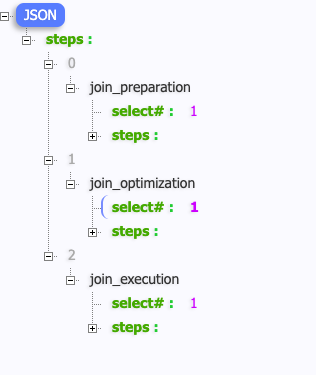

          optimizer_trace 执行 大纲图

## join_optimization(优化阶段)

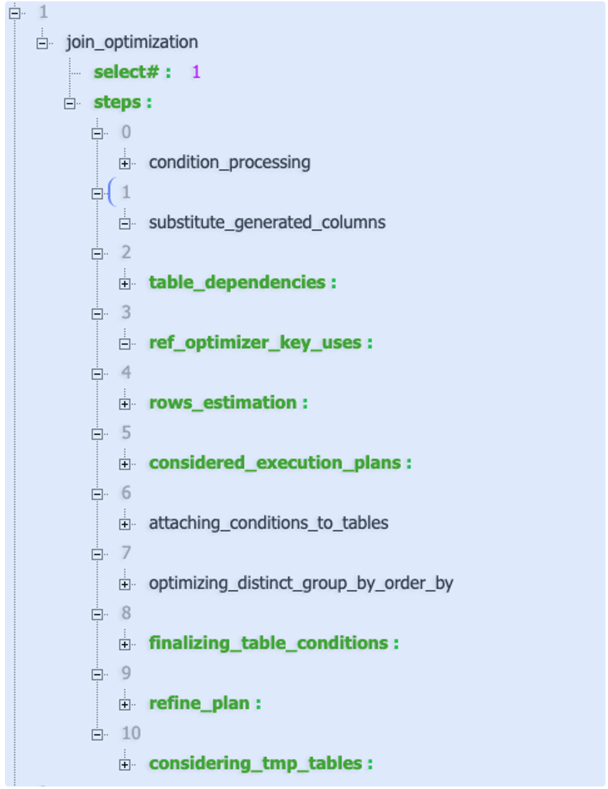

主要介绍4个

1. ref_optimizer_key_uses ：如果优化器认为查询可以使用ref的话，在这里列出可以使用的索引。
2. rows_estimation ：估算表行数和扫描的代价。如果查询中存在range扫描的话，对range扫描进行计划分析及代价估算。
3. considered_execution_plans ：对比各可行计划的代价，选择相对最优的执行计划。
4. attaching_conditions_to_tables ：添加附加条件，使得条件尽可能筛选单表数据。

### ref_optimizer_key_uses

列出了所有可用的ref类型的索引。如果是使用了组合索引的多个部分，在ref_optimizer_key_uses下会列出多个结构体。

### rows_estimation

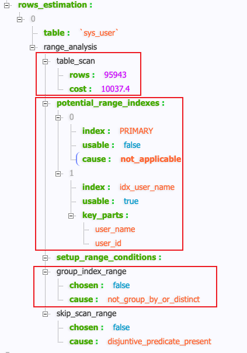

1. table_scan： 全表扫描的行数(rows)以及所需要的代价(cost)。
2. potential_range_indexes： 该阶段会列出表中所有的索引并分析其是否可用，并且还会列出索引中可用的列字段。
3. group_index_range： 评估在使用了GROUP BY或者是DISTINCT的时候是否有适合的索引可用。

### considered_execution_plans
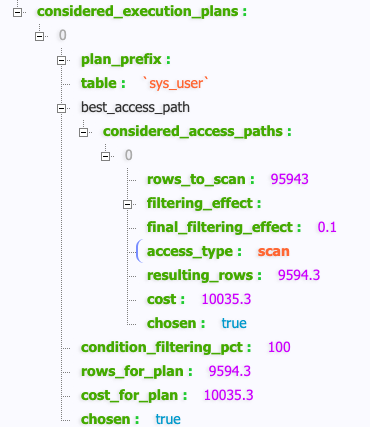

1. table：分析的表对象名称及其别名。
2. plan_prefix：前置的执行计划（格式：顺序ID：表名）。 如果 test t1 left join test2 t2 ,  这里会显示 0:”t1”
3. best_access_path：当前最优的执行顺序信息结果集
    1. considered_access_paths 数组
        1. rows_to_scan: 95943  扫描行数
        2. access_type: scan   表示使用索引的方式。可参照为explain中的type字段
        3. cost 成本
        4. chosen ： true 表示最终使用了该方案，如果是false，不使用；
    2. condition_filtering_pct：类似于explain中的filtered列，这是一个估算值。
    3. rows_for_plan：该执行计划最终的扫描行数，这里的行数其实也是估算值。
    4. cost_for_plan：该执行计划的执行代价，由considered_access_paths的cost相加而得。
    5. chosen：是否选择了该执行计划。

## 这里只重点分析：join_execution(执行阶段)

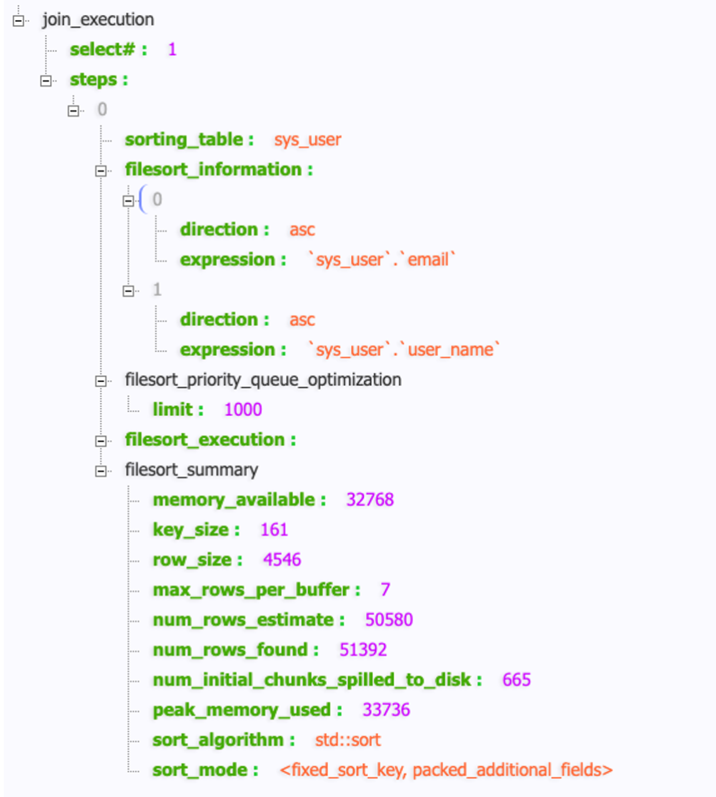

1. sorting_table: 排序表
2. filesort_information 排序的字段
3. filesort_priority_queue_optimization  优先队列优化排序，一般在使用limit 子句的时候会使用优先队列
4. filesort_execution：执行文件排序。
5. filesort_summary：文件排序汇总信息。
    1. memory_available.  可用内存，可以理解为是sort_buffer_size设置的值
    2. num_rows_found     有多少条数据参与排序，越小越好
    3. num_initial_chunks_spilled_to_disk  产生了几个临时文件，0表示完全基于内存排序
    4. sort_mode：
        - <varlen_sort_key,rowid>：使用了rowid排序模式
        - <varlen_sort_key, additional_fields>：使用了全字段排序模式
        - <varlen_sort_key, packed_additional_fields>：使用了打包字段排序模式
    
    e:  peak_memory_used      **表示排序过程中任意时刻使用的最大内存。**
    

# 当 order by 语句执行的比较慢时，我们可以通过如下方法来进行优化

## 1. 不要用 * 作为查询列表，只返回需要的列

## 2. 尽量让排序的字段可以使用索引，避免filesort发生；

## 3. 如果出现filesort，对其优化

1. 首先查看自己的mysql 版本；
2. 其实不赞成这里的优化，因为修改的是全局变量，可能这里好了，其他的sql 受影响了。
3. 可以调整参数：
    1. max_length_for_sort_data ； 修改其大小，可以让mysql 排序选择 全局排序还是rowid 字段排序。(从 8.0.20 开始废弃了)
    2. sort_buffer_size  增加 `[sort_buffer_size](https://dev.mysql.com/doc/refman/8.0/en/server-system-variables.html#sysvar_sort_buffer_size)` 变量值。理想情况下，该值应该足够大，以便整个结果集适合排序缓冲区（以避免写入磁盘和合并过程）。
    3. 增加 `[read_rnd_buffer_size](https://dev.mysql.com/doc/refman/8.0/en/server-system-variables.html#sysvar_read_rnd_buffer_size)` 变量值以便一次读取更多行。

## 4. 从业务角度考虑，拆解sql