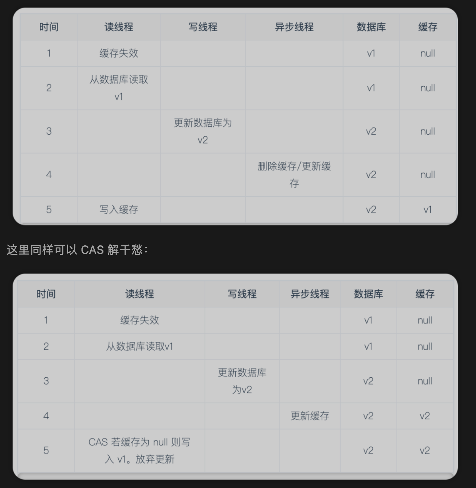

## 自己使用的场景
通常我们是先从缓存中读取,如果有,返回；如果没有,则从数据库中读取，返回写入缓存,设置缓存时间,并返回。   
代码如下：
``` java
public String getUserName(Integer userId){
   // 因为key 通常会加一些前缀，作为指定作用的key; 这里id实际是userId.
   String  userIdkey = "redis:userId:"+userId;
   String  userName = redis.get(userIdkey);
   int cacheTimeSin  = 60;
   if(StringUtils.isNotEmppty()){
      return userName;
   }
   userName = userMapper.getOne(1);
   redis.set(userIdkey,userName,cacheTimeSin, TimeUnit.SECONDS);
   return userName;
}  
```
写到这里是不是发现还会有一个问题？就是如果 userName 在其他地方更新了呢？ 所以一定还有一段：
``` java
public boolean updateUserName(Integer userId,String userName){
  // 
  String  userIdkey = "redis:userId:"+userId;
  // 删除缓存
  redis.delete(userIdkey);
  userMapper.updateUserNameById(userId,userName);
}
```
想一想，如果这两个操作是两个线程操作？并且交叉操作呢？会发生什么问题？
## 在使用redis作为缓存时,写操作
当执行写操作后，因为需要保证从缓存读取到的数据与数据库中的数据是一致的，这就需要对缓存进行更新。
## 旧key 是删除还是更新？缓存和数据库的更新顺序？
1. 想想，自己目前使用的方式是什么？
2. 想想，还有什么方式？以及对比自己使用的，优劣对比？
## 四大策略
### 1. 先删除缓存，再更新数据库
- 并发问题:
>>写： 线程张三  
>>读： 线程李四

|顺序|线程:张三|线程:李四|数据库|缓存|
|:----|:----:|----:|----:|----:|
|1|删除缓存||v1||
|2||缓存失效|v1||
|3||从数据库读取数据为v1|v1||
|4|更新数据库为v2||v2||
|5||将v1写入缓存|v2|v1|

### 2. 先更新数据库，再删除缓存
1. 若数据库更新成功，删除缓存操作失败，则此后读到的都是缓存中过期的数据，造成不一致问题。
2. 并发问题:
>>读： 线程张三  
>>写： 线程李四

|顺序|线程:张三|线程:李四|数据库|缓存|
|:----|:----:|----:|----:|----:|
|1|缓存失效||v1||
|2|从数据库读取数据为v1||v1||
|3||更新数据库|v2||
|4||删除缓存|v2||
|5|写入缓存||v2|v1|

### 3. 先更新缓存，再更新数据库
1. 缓存更新成功，数据库有更新失败的风险；导致最新的数据未持久化，风险很高。
2. 并发问题。  
>>写： 线程张三  
>>写： 线程李四

|顺序|线程:张三|线程:李四|数据库|缓存|
|:----|:----:|----:|----:|----:|
|1|||v0|v0|
|2|更新缓存为v1||v0|v1|
|3||更新缓存为v2|v0|v2|
|4||更新数据库为v2|v2|v2|
|5|更新数据库为v1||v1|v2|

### 4. 先更新数据库，再更新缓存
1. 同删除缓存策略一样，若数据库更新成功缓存更新失败则会造成数据不一致问题。
2. 并发问题。 
>>写： 线程张三  
>>写： 线程李四

|顺序|线程:张三|线程:李四|数据库|缓存|
|:----|:----:|----:|----:|----:|
|1|||v0|v0|
|2|更新缓存为v1||v1|v0|
|3||更新缓存为v2|v2|v0|
|4||更新数据库为v2|v2|v2|
|5|更新数据库为v1||v2|v1|

## 对于旧key,目前已知的两种策略
1. 删除失效缓存: 读取时会因为未命中缓存而从数据库中读取新的数据并更新到缓存中
2. 更新缓存: 直接将新的数据写入缓存覆盖过期数据
## 更新缓存和数据库的前后顺序，也有两种
1. 先数据库后缓存
2. 先缓存后数据库
## 总结,设计需要考虑的问题
根据实际场景选择一款就行，折中；
### 对系统吞吐量的影响：
  比如更新缓存策略产生的数据库负载小于删除缓存策略的负载
### 并发安全性：
  并发读写时某些异常操作顺序可能造成数据不一致，如缓存中长期保存过时数据
### 更新失败的影响：
   若某个操作失败，如何对业务影响降到最小
### 检测和修复故障的难度:
   操作失败导致的错误会在日志留下详细的记录容易检测和修复。并发问题导致的数据错误没有明显的痕迹难以发现，且在流量高峰期更容易产生并发错误产生的业务风险较大。

## 如何解决以上并发导致的问题？
### 1. 使用 CAS
CAS (Check-And-Set 或 Compare-And-Swap)是一种常见的保证并发安全的手段。CAS 当且仅当客户端最后一次取值后该 key 没有被其他客户端修改的情况下，才允许当前客户端将新值写入。

- CAS 是一种乐观锁

假如缓存初始值是v0,更新缓存的时候，必须要校验值等于v0，才去更新，否则放弃。

- 目前已知的redis 提供CAS命令的中间件和redis官方支持的。
>> 1. 比如阿里的 Tair 以及腾讯的 Tendis。  
>> 2. Redis 官方提供了 Watch + 事务的方法来支持 CAS, 或者使用 redis 中 lua 脚本原子性执行的特点来实现 CAS。(比较复杂)


### 2. 使用分布式锁

- 分布式锁是一种悲观锁

>>1. 线程张三 拿到锁   
>>2. 线程张三操作   
>>3. 线程张三 释放锁  
>>4. 线程李四 拿到锁  
>>5. 线程李四操作    
>>6. 线程李四 释放锁 

可以解决并发问题，只是成本可能略高。
### 3. 延时双删
- 问题是: 读线程的写入缓存操作，发生于写线程的数据库数据更新之后。会发生缓存和数据库数据不一致的问题。   
- 解决： 因为是读线程最后写入缓存，此时再清除缓存是不是就可以解决这个问题？  
延时双删就是写线程等待一段时间“确保”读线程都结束后再次删除缓存，以此清除可能的错误缓存数据。
- 需要注意的是: 因为无法确保读线程何时结束,所以仍有存在数据不一致的可能。

但是延时双删实现成本很低而且极大的减少了并发问题出现的概率，不失为一种简单实用的手段。

结果如下：

|顺序|线程:张三|线程:李四|数据库|缓存|
|:----|:----:|----:|----:|----:|
|1|删除缓存||v1||
|2||缓存失效|v1||
|3||从数据库读取数据为v1|v1||
|4|更新数据库为v2||v2||
|5||将v1写入缓存|v2|v1|
|6|延时一段时间,删除缓存||v2||

### 4. 异步更新

阿里开源了 MySQL 数据库binlog的增量订阅和消费组件 - canal。canal 模拟从库获得主库的 binlog 更新，然后将更新数据写入 MQ 或直接进行消费。   
我们可以让API服务器只负责写入数据库，另一个线程订阅数据库 binlog 增量进行缓存更新。  
因为 binlog 是有序的，因此可以避免两个写线程竞争。但我们仍然需要解决读写线程竞争的问题:



## 实际场景中，你采用的是何种方式？
## 这里可以延伸的问题？
1. 如果使用的分布式锁，用的哪种？了解其原理不？
2. 如果采用先删除缓存/缓存失效？导致大量请求到数据库？