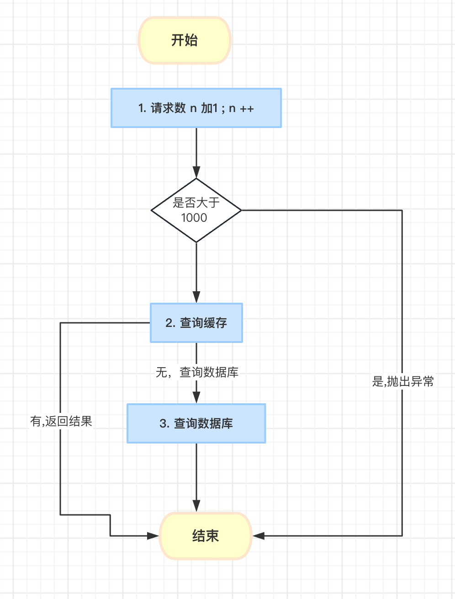
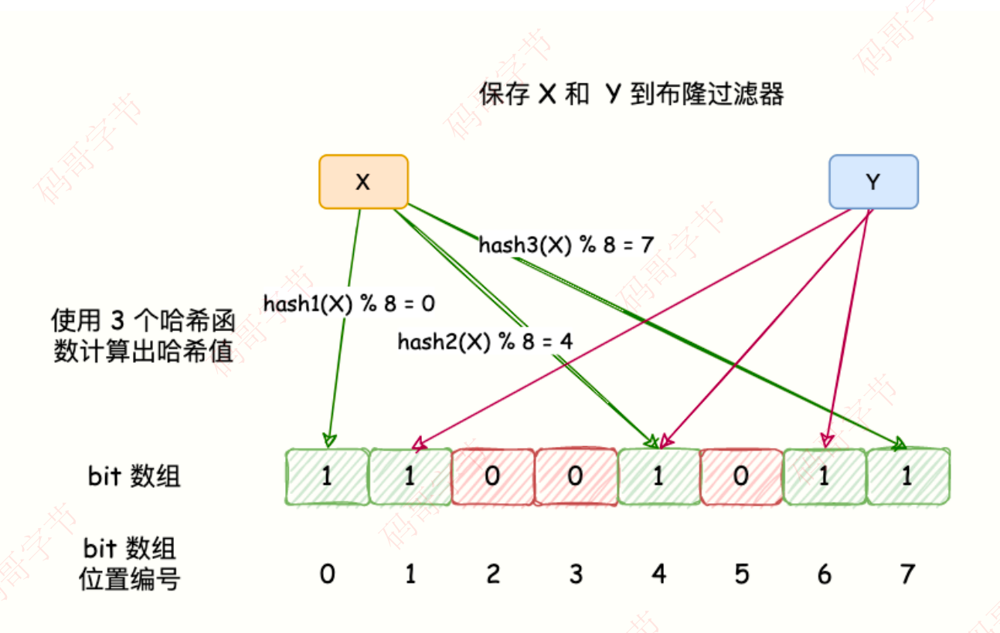
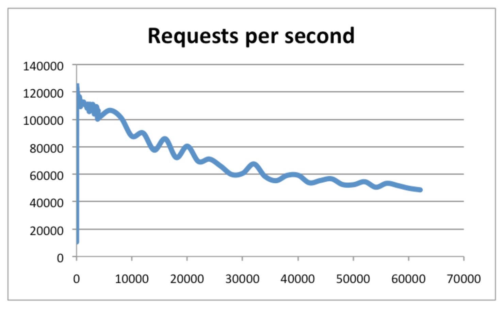
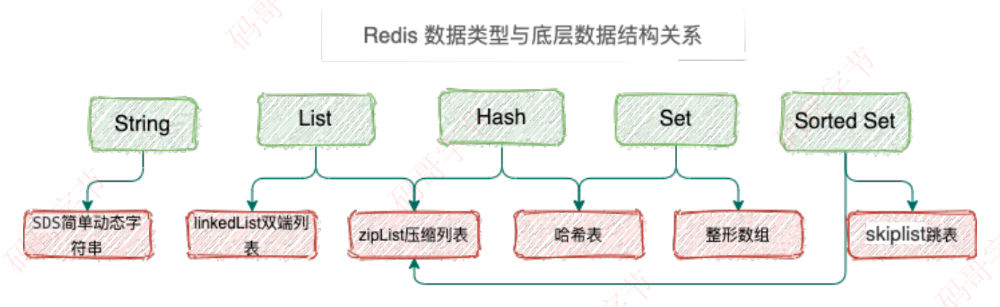

## 缓存击穿（失效）
### 原因: 缓存不存在
- 背景: 缓存被删除或者失效
- 现象：热点数据，直接请求数据库，由于⾼并发，可能会把 DB 压垮，导致服务不可⽤。
- 关键字：单⼀热点数据、⾼并发、数据失效
- 描述：
⾼并发流量，访问的这个数据是热点数据，请求的数据在 DB 中存在，但是 Redis 存的那⼀份已经过期，后端需要从 DB 从加载数据并写到 Redis。

### 解决方案：
1. 过期时间 + 随机值

   对于热点数据，我们不设置过期时间，这样就可以把请求都放在缓存中处理，充分把 Redis ⾼吞吐量性能利⽤起来。
   或者过期时间再加⼀个随机值。  
  设计缓存的过期时间时，使⽤公式：过期时间=baes 时间+随机时间。即相同业务数据写缓存时，在基础过期时间之上，再加⼀个随机的过期时间，让数据在未来⼀段时间内慢慢过期，避免瞬时全部过期，对 DB 造成过⼤压⼒  

2. 预热  
分析热门数据,单独处理。预先把热⻔数据提前存⼊ Redis 中，并设热⻔数据的过期时间超⼤值。
3. 加锁

   -  当发现缓存失效的时候，不是⽴即从数据库加载数据。
   -  ⽽是先获取分布式锁，获取锁成功，再去查询一次缓存，如果为null,才执⾏数据库查询和写数据到缓存的操作，获取锁失败，则说明当前有线程在执数据库查询操作，当前线程睡眠⼀段时间在重试。
   - 这样只让⼀个请求去数据库读取数据
   ```
    public Object getData(String id) {
        String desc = redis.get(id);
        // 缓存为空，过期了
        if (desc == null) {
            // 互斥锁，只有⼀个请求可以成功
            if (redis(lockName)) {
                try{
                    // 这里一定要再读一次，不然大量请求到了这一步，就算缓存中有了，也要全部请求一次数据库。
                   desc = redis.get(id);
                   if(null != desc) return desc;
                   // 从数据库取出数据
                   desc = getFromDB(id);
                   // 写到 Redis
                   redis.set(id, desc, 60 * 60 * 24);
                } catch (Exception ex) {
                    LogHelper.error(ex);
                } finally {
                   // 确保最后删除，释放锁
                   redis.del(lockName);
                   return desc;
                }
           } else {
               // 否则睡眠200ms，接着获取锁
               Thread.sleep(200);
               return getData(id);
           }
        }
    }
   ```

## 缓存穿透

### 原因：数据在【缓存和数据库】中不存在
缓存穿透：意味着有特殊请求在查询⼀个不存在的数据，即不数据存在 Redis 也不存在于数据库。
导致每次请求都会穿透到数据库，缓存成了摆设，对数据库产⽣很⼤压⼒从⽽影响正常服务。



### 解决⽅案
- 缓存空值：当请求的数据不存在 Redis 也不存在数据库的时候，设置⼀个缺省值（⽐如：None）。当后续再次进⾏查询则直接返回空值或者缺省值。   
- 布隆过滤器：在数据写⼊数据库的同时将这个 ID 同步到到布隆过滤器中，当请求的 id 不存在布隆过滤器中则说明该请求查询的数据⼀定没有在数据库中保存，就不要去数据库查询了
**布隆过滤器**
BloomFilter 要缓存全量的 key，这就要求全量的 key 数量不⼤，10 亿 条数据以内最佳，因为 10 亿 条数据⼤概要占⽤ 1.2GB 的内存。

说下布隆过滤器的原理吧

BloomFilter 的算法是，⾸先分配⼀块内存空间做 bit 数组，数组的 bit 位初始值全部设为 0。
加⼊元素时，采⽤ k 个相互独⽴的 Hash 函数计算，然后将元素 Hash 映射的 K 个位置全部设置为1。

检测 key 是否存在，仍然⽤这 k 个 Hash 函数计算出 k 个位置，如果位置全部为 1，则表明 key 存在，否则不存在。



哈希函数会出现碰撞，所以布隆过滤器会存在误判。
这⾥的误判率是指，BloomFilter 判断某个 key 存在，但它实际不存在的概率，因为它存的是 key 的 Hash 值，⽽⾮ key 的值。

所以有概率存在这样的 key，它们内容不同，但多次 Hash 后的 Hash 值都相同。
对于 BloomFilter 判断不存在的 key ，则是 100% 不存在的，反证法，如果这个 key 存在，那它每次 Hash 后对应的 Hash 值位置肯定是 1，⽽不会是 0。布隆过滤器判断存在不⼀定真的存在。


## 缓存雪崩
缓存雪崩指的是⼤量的请求⽆法在 Redis 缓存系统中处理，请求全部打到数据库，导致数据库压⼒激增，甚⾄宕
机。
出现该原因主要有两种：
- ⼤量热点数据同时过期，导致⼤量请求需要查询数据库并写到缓存；
- Redis 故障宕机，缓存系统异常。
### 原因一：**缓存⼤量数据同时过期**

数据保存在缓存系统并设置了过期时间，但是由于在同时⼀刻，⼤量数据同时过期。  
系统就把请求全部打到数据库获取数据，并发量⼤的话就会导致数据库压⼒激增。  
缓存雪崩是发⽣在⼤量数据同时失效的场景，⽽缓存击穿（失效）是在某个热点数据失效的场景，这是他们最⼤的区别。



### 原因一：解决⽅案  
1. 过期时间添加随机值
    要避免给⼤量的数据设置⼀样的过期时间，过期时间 = baes 时间+ 随机时间（较⼩的随机数，⽐如随机增加 1~5分钟）。   
    这样⼀来，就不会导致同⼀时刻热点数据全部失效，同时过期时间差别也不会太⼤，既保证了相近时间失效，⼜能满⾜业务需求。
2. 接⼝限流
    当访问的不是核⼼数据的时候，在查询的⽅法上加上接⼝限流保护。⽐如设置 10000 req/s。  
    如果访问的是核⼼数据接⼝，缓存不存在允许从数据库中查询并设置到缓存中。  
    这样的话，只有部分请求会发送到数据库，减少了压⼒。  
    限流，就是指，我们在业务系统的请求⼊⼝前端控制每秒进⼊系统的请求数，避免过多的请求被发送到数据库。

    

### 原因二：**Redis 故障宕机**

⼀个 Redis 实例能⽀撑 10 万的 QPS，⽽⼀个数据库实例只有 1000 QPS。   
⼀旦 Redis 宕机，会导致⼤量请求打到数据库，从⽽发⽣缓存雪崩。

### 原因二： 解决方案：

对于缓存系统故障导致的缓存雪崩的解决⽅案有两种：
- 服务熔断和接⼝限流；
- 构建⾼可⽤缓存集群系统。
#### 服务
**服务熔断和限流**

在业务系统中，针对⾼并发的使⽤服务熔断来有损提供服务从⽽保证系统的可⽤性。
服务熔断就是当从缓存获取数据发现异常，则直接返回错误数据给前端，防⽌所有流量打到数据库导致宕机。
服务熔断和限流属于在发⽣了缓存雪崩，如何降低雪崩对数据库造成的影响的⽅案。

**构建⾼可⽤的缓存集群** 

所以，缓存系统⼀定要构建⼀套 Redis ⾼可⽤集群，⽐如 《Redis 哨兵集群》或者 《Redis Cluster 集群》，如果Redis 的主节点故障宕机了，从节点还可以切换成为主节点，继续提供缓存服务，避免了由于缓存实例宕机⽽导致的缓存雪崩问题。

## 总结
- 缓存穿透指的是数据库本就没有这个数据，请求直奔数据库，缓存系统形同虚设。
- 缓存击穿（失效）指的是数据库有数据，缓存本应该也有数据，但是缓存过期了，Redis 这层流量防护屏障被
击穿了，请求直奔数据库。
- 缓存雪崩指的是⼤量的热点数据⽆法在 Redis 缓存中处理（⼤⾯积热点数据缓存失效、Redis 宕机），流量全部打到数据库，导致数据库极⼤压⼒。


## 思考